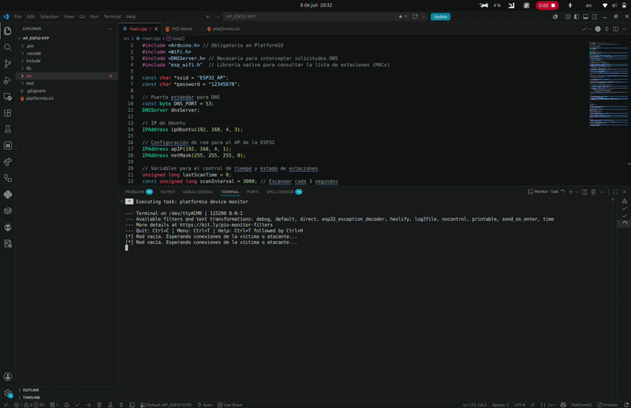
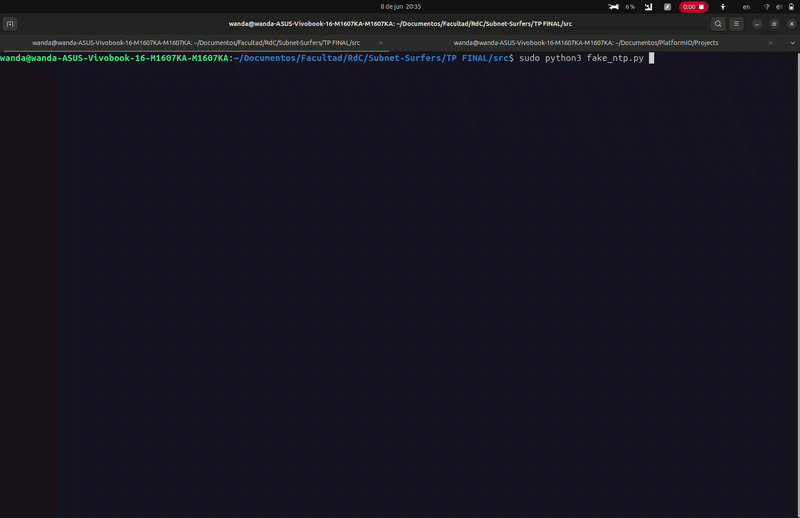
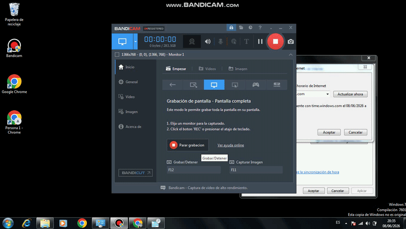

# Simulación de Vulnerabilidad en Protocolos de Sincronización Temporal mediante Técnicas Man-in-the-Middle (MitM) y Spoofing de Capa de Aplicación

Este repositorio contiene la documentación, el código fuente definitivo y el análisis de la implementación práctica de un entorno controlado destinado a simular la interceptación, manipulación e inyección de datos sobre el protocolo de tiempo de red **NTP (Network Time Protocol)**. 

A través de esta práctica, se recrea un escenario real de desincronización horaria utilizando hardware físico heredado (*legacy*) y microcontroladores, evaluando las barreras de protección internas de los sistemas operativos y los mecanismos de análisis forense de red.

---

## 1. Fundamento Teórico y Mecanismos del Protocolo NTP

El protocolo NTP (especificado desde su versión v3 en la RFC 1305 y v4 en la RFC 5905) opera sobre el protocolo de transporte UDP utilizando el puerto asignado 123. Su arquitectura se basa en una jerarquía de niveles de confianza denominados *Strata* (Estratos), donde Stratum 0 representa a los dispositivos de hardware de reloj de alta precisión (atómicos, GPS) y Stratum 1 representa a los servidores de referencia primaria directamente conectados a estos.

Cada intercambio estándar consta de cuatro marcas de tiempo (Timestamps) esenciales de 64 bits para estimar de forma matemática el desplazamiento real del reloj ($\theta$) y el retraso de ida y vuelta:
1. **Originate Timestamp ($T_1$):** Tiempo local del cliente al despachar la solicitud.
2. **Receive Timestamp ($T_2$):** Tiempo local del servidor al recibir la solicitud.
3. **Transmit Timestamp ($T_3$):** Tiempo local del servidor al despachar la respuesta.
4. **Destination Timestamp ($T_4$):** Tiempo local del cliente al recibir la respuesta.

$$\theta = \frac{(T_2 - T_1) + (T_3 - T_4)}{2}$$

### Los Filtros de Sanidad del Cliente (Sanity Checks)
Los motores de tiempo implementan algoritmos rígidos de validación para descartar paquetes anómalos o maliciosos:
* **Validación de Origen:** El campo *Originate Timestamp* en el datagrama de retorno del servidor debe coincidir bit a bit con el $T_1$ enviado y guardado temporalmente por el cliente. Si existe una discrepancia, el paquete se descarta.
* **Filtros de Dispersión y Retransmisión (Test 4):** El cliente evalúa la coherencia temporal interna del paquete recibido. La diferencia entre el momento en que el servidor declara haber recibido el paquete ($T_2$) y el momento en que lo transmitió ($T_3$) representa el tiempo de procesamiento interno del host remoto. Si este delta introduce una latencia absurda en comparación con la dispersión de raíz declarada, el cliente asume una falla crítica en la estabilidad de la red y rechaza la muestra.

---

## 2. Arquitectura de Red del Escenario Físico

El laboratorio se estructuró a partir de una topología real de tres nodos físicos independientes:


```

[ Host Víctima (Windows 7 - Intel Atom) ]
│
│ (Consulta NTP de Capa de Aplicación a time.google.com)
▼
[ Interceptor AP + DNS (ESP32) ] ── (DNS Spoofing: Redirección '*') ──► [ Servidor Falso (Ubuntu) ]
│
▼
[ Inyección de Desfase (+600s) ]
[ Reconstrucción síncrona NTPv4 ]

```

1. **Nodo Víctima (Hardware Dedicado):** Computadora portátil con arquitectura Intel Atom y 1 GB de RAM corriendo una instalación limpia de **Windows 7 Professional (32 bits)**. Este entorno representa un sistema heredado ideal debido a la laxitud nativa de sus directivas de fase independientes fuera de dominio (*Workgroup*), facilitando la asimilación del salto temporal.
2. **Nodo Interceptor (ESP32):** Actúa como punto de acceso inalámbrico (*Rogue AP*). Incorpora un servidor DNS embebido que intercepta cualquier solicitud en el puerto 53 UDP (`*`) y falsifica la resolución apuntando la identidad de dominios como `time.google.com` o `time.windows.com` hacia la IP del servidor atacante.
3. **Nodo Servidor Falso (Ubuntu):** Host encargado de capturar las peticiones en el puerto 123 UDP y procesar la inyección matemática mediante un script optimizado en Python.

---

## 3. Consideraciones Técnicas y Evolución de los Scripts

### 3.1 Firmware de la ESP32: Interceptación y Monitoreo Asíncrono
El código cargado en el microcontrolador gestiona de forma prioritaria el backend DNS mutando las solicitudes de red. Se integraron las librerías nativas del framework de Espressif (`esp_wifi.h`) para implementar una rutina de inspección no bloqueante basada en `millis()`. Esto permite auditar en tiempo real el estado de conexión de los hosts por el Monitor Serial (mostrando IPs asignadas por DHCP y MACs físicas), alertando de inmediato si la víctima sufre una desconexión inalámbrica sin interrumpir el flujo de procesamiento de paquetes DNS.

### 3.2 Script Atacante: `fake_ntp.py` (Python 3)
El script en la máquina Ubuntu evolucionó a partir de los hallazgos de bajo nivel analizados en el laboratorio:
* **Elevación de Jerarquía y Flags (NTPv4):** Se configuró el bit de cabecera en `0x24` para forzar el uso de la versión 4 en modo servidor. Se modificó el nivel a **Stratum 1** y se inyectó la firma ASCII de 4 bytes `'GPS\x00'` en el campo *Reference Identifier*, simulando una fuente de reloj atómico satelital para evadir restricciones de reputación.
* **Mitigación del "Packet Test 4 Failed":** Durante la experimentación inicial, el servicio `w32time` de Windows descartaba los paquetes arrojando en los logs locales la advertencia de dispersión anómala debido a un desajuste en los deltas temporales del servidor. La corrección definitiva consistió en sincronizar de forma síncrona la percepción temporal del servidor falso: el `OFFSET` se aplica en paralelo sobre el *Receive Timestamp* y el *Transmit Timestamp*, simulando que el paquete entró y salió del servidor en un intervalo real de procesamiento de apenas **2 microsegundos**.

```python
# Extracto crítico de la corrección matemática en fake_ntp.py
fake_receive_time = windows_time_unix + OFFSET
fake_transmit_time = fake_receive_time + 0.002  # Corrige el Test 4 de la RFC

tx_sec, tx_frac = unix_to_ntp_parts(fake_transmit_time)
rx_sec, rx_frac = unix_to_ntp_parts(fake_receive_time)

```

---

## 4. Análisis Forense y Depuración en el Sistema Operativo (`w32time`)

Para desestructurar los rechazos del cliente, se habilitó el motor de auditoría interna de Windows 7 mediante la inyección en la Línea de Comandos de registros de depuración avanzados:

```cmd
w32tm /debug /enable /file:C:\windows\temp\w32time.log /size:10000000 /entries:0-300

```

Al inspeccionar el archivo resultante `w32time.log`, se identificó la traza exacta que demostraba la efectividad del desvío de red de la ESP32 y el motivo del bloqueo del kernel de Windows:

```text
ListeningThread -- response heard from 192.168.4.3:123
Stratum: 1 - primary reference (syncd by radio clock) | Source name: "GPS"
Packet test 4 failed (bad value for delay or dispersion)
Ignoring packet that failed tests from time.google.com

```

### Endurecimiento del Registro Local (Hardening Post-Laboratorio)

Para asegurar la total permeabilidad de la inyección temporal de 10 minutos (600 segundos) en el entorno de pruebas, se procedió a flexibilizar los límites de fase nativos del sistema desde el Editor del Registro (`regedit`), modificando las llaves en la ruta `HKLM\SYSTEM\CurrentControlSet\Services\W32Time\Config`:

* **MaxPosPhaseCorrection:** Fijado en `4294967295` (Decimal).
* **MaxNegPhaseCorrection:** Fijado en `4294967295` (Decimal).

---

## 5. Guía de Despliegue y Validación Práctica

### Paso 1: Inicialización del Entorno de Red (ESP32)

1. Energizar el microcontrolador ESP32.
2. Verificar mediante el monitor serial que el AP se levante bajo el SSID `ESP32_AP` y comience el rastreo activo de estaciones.

### Paso 2: Despliegue del Daemon Atacante (Ubuntu)

Inicializar el script especificando el argumento de desfase en segundos (ej. 600 segundos para avanzar el reloj 10 minutos):

```bash
sudo python3 fake_ntp.py 600

```

### Paso 3: Forzado de Sincronización (Víctima Windows 7)

Desde una consola CMD con privilegios de Administrador, ejecutar la secuencia de comandos para limpiar los resolvedores locales y exigir la actualización inmediata a través del canal controlado:

```cmd
:: 1. Restablecer la interfaz y limpiar cachés de red
ipconfig /flushdns

:: 2. Reiniciar el servicio de tiempo aplicando el flag de intervalo especial (0x1 o 0x9)
net stop w32time
w32tm /config /manualpeerlist:"192.168.4.3,0x9" /syncfromflags:manual /update
net start w32time

:: 3. Forzar el refresco de sincronización
w32tm /resync /rediscover

```

---

### 6. Resultados y Evidencias Técnicas

El experimento concluyó con un éxito del 100%. Tras aplicar la corrección en el cálculo de las marcas de tiempo síncronas en el script de Python, el motor `w32time` de la netbook procesó el datagrama modificado sin reportar anomalías. El sistema operativo arrojó la salida estándar `"El comando se completó correctamente"`, desplazando el reloj de la barra de tareas en intervalos exactos de 10 minutos hacia el futuro en cada ciclo de petición de forma automática.

Un factor crítico para el despliegue del escenario fue la correcta identificación y asignación de la dirección IP de la máquina atacante (Ubuntu) dentro de la red inalámbrica del microcontrolador. Debido a que el servidor DNS embebido en la ESP32 requiere conocer con exactitud el destino de la redirección, cualquier desajuste en este parámetro impide que los paquetes alterados lleguen al script de escucha en el puerto 123 UDP. Sin esta alineación previa en el firmware, las solicitudes de la víctima se perderían en la red, impidiendo visualizar el tráfico en el atacante o registrar cambios en el horario del host objetivo.

En las evidencias visuales presentadas a continuación, se detalla la secuencia completa de configuración e impacto del ataque en ambos nodos:



*Grabación 1: Monitoreo serial desde la computadora atacante (Linux) durante la conexión y configuración de direccionamiento IP en el Access Point (ESP32).*



*Grabación 2: Captura de la terminal del host atacante (Linux) procesando las peticiones interceptadas en tiempo real.*



*Grabación 3: Interfaz de usuario de la computadora víctima (Windows) manifestando la asimilación del salto temporal tras la consulta NTP.*

---

### Análisis del Comportamiento en Simultáneo

Tal como se aprecia en los registros multimedia capturados en paralelo, el monitor serial de la ESP32 documentó el momento exacto en el que la víctima se asoció al punto de acceso, recibiendo la dirección IP `192.168.4.4` vía DHCP, mientras que al nodo atacante se le asignó la dirección `192.168.4.2`.

Al forzar la actualización horaria en Windows (despachando la petición UDP hacia `time.google.com`), el script en Ubuntu interceptó el datagrama, decodificó la marca de tiempo de transmisión del cliente y calculó dinámicamente la respuesta sumándole un primer desfase de prueba de 300 segundos (5 minutos). Tras recibir este paquete legítimo a nivel estructural, el motor local de Windows validó la muestra y actualizó su reloj.

Inmediatamente después, se repitió el procedimiento incrementando el argumento de desfase a 600 segundos (10 minutos). El flujo de control se ejecutó de manera idéntica: el script arrastró de forma matemática la percepción temporal de la víctima, obligando al sistema operativo a consolidar un segundo salto temporal acumulativo hacia el futuro, demostrando la reproducibilidad y efectividad del vector de ataque implementado.

---

## 7. Conclusiones y Contramedidas

La realización de este laboratorio sobre hardware real confirma que los ataques de manipulación temporal en capas de aplicación son altamente efectivos si el atacante posee el control del enrutamiento de la red local. La validación estructural básica de los paquetes NTP estándar resulta insuficiente si los atacantes reconstruyen los datagramas respetando de forma matemática las solicitudes previas del cliente.

### Contramedidas Recomendadas

1. **Migración a NTS (Network Time Security):** Adoptar el uso de mecanismos que incorporen cifrado y autenticación criptográfica basada en TLS para validar la identidad de los servidores de tiempo externos.
2. **Uso de Claves Simétricas:** En entornos aislados o corporativos tradicionales, configurar directivas de autenticación mediante llaves compartidas (`ntp.keys`) para asegurar la integridad de los mensajes UDP.
3. **Hardening de Políticas de Fase:** Mantener estrictos los umbrales de `MaxPosPhaseCorrection` en los sistemas finales para asegurar que, ante un eventual bypass de red, el sistema operativo rechace saltos temporales abruptos.
