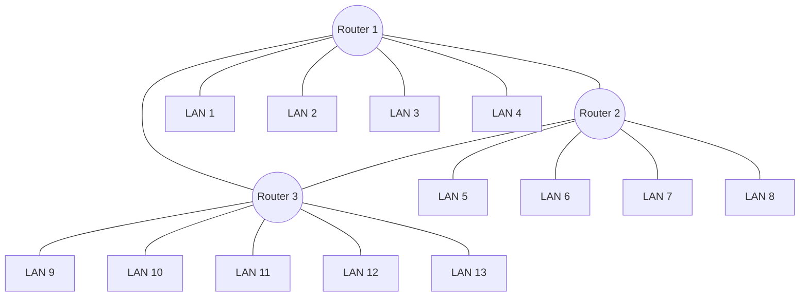

# Redes de Computadoras - Trabajo Práctico N° 1 (Parte 1)

# Simulación de envío de paquetes, ARP y ruteo entre redes

**Integrantes:**

- _Maria Wanda Molina_
- _Marcos Moran_
- _Martina Juri_
- _Francisco Gomez Neimann_

**Nombre del grupo:**

Subnet Surfers

**Nombre del centro educativo o institución:**

Facultad de Ciencias Exactas, Físicas y Naturales

**Profesores:**

Santiago M. Henn

**Materia:**

Redes de Computadoras

**Fecha:**

15 de marzo de 2026

---

### Información de los autores

- Información de contacto:

* [wanda.molina@mi.unc.edu.ar](mailto:wanda.molina@mi.unc.edu.ar)
* [mmoran@mi.unc.edu.ar](mailto:mmoran@mi.unc.edu.ar)
* [martina.juri@mi.unc.edu.ar](mailto:martina.juri@mi.unc.edu.ar)
* [francisco.gomez.neimann@mi.unc.edu.ar](mailto:francisco.gomez.neimann@mi.unc.edu.ar)

---

# Resumen

El presente trabajo práctico tuvo como objetivo analizar el proceso de transmisión de paquetes dentro de una red compuesta por múltiples subredes interconectadas mediante routers. A través de una simulación de laboratorio se modeló el comportamiento de hosts y routers durante el envío y recepción de paquetes IP encapsulados en frames Ethernet.

Durante la actividad se observaron distintos mecanismos fundamentales del funcionamiento de las redes de computadoras, tales como la resolución de direcciones mediante el protocolo ARP, el uso del gateway por defecto para la comunicación entre redes diferentes y el proceso de ruteo hop-by-hop realizado por los routers intermedios.

Asimismo, se analizó el recorrido de un paquete desde una red de origen hacia una red destino, identificando los cambios en las direcciones MAC en cada salto, el mantenimiento de las direcciones IP a lo largo de todo el trayecto y la disminución progresiva del campo TTL. Estos elementos permitieron comprender de forma práctica cómo se produce la transmisión de datos entre distintas redes dentro de una infraestructura de comunicación.

## Introducción

El objetivo de este trabajo práctico fue comprender de manera práctica el funcionamiento del envío de paquetes en redes, incluyendo los mecanismos de encapsulación, resolución ARP, uso de gateway por defecto y ruteo entre redes.

Durante la actividad se simuló el comportamiento de hosts y routers dentro de una topología de red distribuida, permitiendo observar cómo los paquetes se transmiten salto por salto hasta alcanzar su destino.

Este informe documenta únicamente la Parte 1 del trabajo práctico, correspondiente a la simulación del envío de paquetes y el proceso de ruteo entre redes.

### Aclaraciones sobre la realización del laboratorio

Debido a que en la reunión de laboratorio solo se encontraba presente un integrante de este grupo, la actividad se realizó en conjunto con otro grupo de la clase (Ethernautas v2).

En este contexto, el integrante representó un host dentro de la red del otro grupo, actuando como dispositivo final dentro de su LAN para poder participar de la simulación de transmisión de paquetes.

## Marco Teórico

### Modelo de comunicación en redes IP

Las redes de computadoras modernas utilizan el protocolo IP para permitir la comunicación entre dispositivos ubicados en distintas redes. En este modelo, cada dispositivo posee una dirección IP que lo identifica de manera lógica dentro de la red.

Cuando un host envía información a otro dispositivo, los datos se encapsulan dentro de un paquete IP que contiene, entre otros campos, la dirección IP de origen y la dirección IP de destino. Este paquete puede atravesar múltiples routers hasta alcanzar el dispositivo final.

### Encapsulación en redes Ethernet

En redes locales basadas en Ethernet, los paquetes IP no se transmiten directamente sobre el medio físico. En su lugar, son encapsulados dentro de frames Ethernet que contienen direcciones MAC de origen y destino.

Las direcciones MAC identifican de manera única a cada interfaz de red dentro de un mismo enlace físico. Debido a esto, las direcciones MAC solo tienen validez dentro de una red local específica.

Cuando un paquete debe atravesar varios routers, cada uno de ellos desencapsula el frame recibido y lo vuelve a encapsular utilizando las direcciones MAC correspondientes al siguiente enlace.

### Protocolo ARP

El protocolo ARP (Address Resolution Protocol) se utiliza para asociar direcciones IP con direcciones MAC dentro de una red local.

Cuando un host necesita enviar un paquete a una dirección IP determinada, primero debe conocer la dirección MAC del dispositivo correspondiente. Si esta información no se encuentra en su tabla ARP, el host envía una solicitud ARP en broadcast preguntando qué dispositivo posee esa dirección IP. El dispositivo correspondiente responde con su dirección MAC.

Este mecanismo permite que los dispositivos puedan comunicarse dentro de una red Ethernet utilizando direcciones físicas.

### Gateway por defecto y ruteo entre redes

Cuando un host necesita comunicarse con un dispositivo que pertenece a otra subred, no envía el paquete directamente al destino final. En su lugar, lo envía al gateway por defecto, que generalmente corresponde a un router conectado a la red local.

El router recibe el paquete y consulta su tabla de ruteo para determinar hacia qué interfaz debe reenviarlo. Este proceso se repite en cada router intermedio hasta que el paquete alcanza la red destino.

Este modelo de funcionamiento se conoce como ruteo hop-by-hop, ya que cada router toma decisiones de reenvío basándose únicamente en su información local.

### Campo TTL

El campo TTL (Time To Live) es un mecanismo de control incluido en los paquetes IP que limita la cantidad de saltos que un paquete puede realizar dentro de la red.

Cada router que procesa el paquete decrementa el valor del TTL en una unidad antes de reenviarlo. Si el valor del TTL llega a cero, el paquete es descartado.

Este mecanismo evita que los paquetes circulen indefinidamente en la red en caso de que exista un bucle de ruteo.

## Resultados

### Identidad de red del dispositivo

La siguiente tabla documenta la configuración de red del host representadao durante la simulación.

| Campo               | Valor             |
| ------------------- | ----------------- |
| Dispositivo         | Host              |
| Rol                 | Host              |
| Dirección IP        | **10.6.0.104**    |
| Dirección MAC       | **AA:43:12**      |
| Máscara de subred   | **255.255.255.0** |
| Gateway por defecto | **10.6.0.1**      |

_Tabla 1. Identidad de Red. Fuente propia_

---

### Topología de red utilizada

Durante la actividad se simuló una red compuesta por múltiples redes LAN interconectadas mediante tres routers.

Los routers estaban conectados entre sí formando una topología triangular, permitiendo múltiples rutas posibles entre las distintas redes.



_Figura 1. Topología de la red. Fuente propia._

En este diagrama:

- **Router 1, Router 2 y Router 3** representan los routers intermedios que conectaban las redes.
- **LAN 1 – LAN 13** representan las redes locales de los distintos grupos.

Cada LAN se encontraba conectada a uno de los routers, que actuaba como gateway por defecto para los hosts de esa red.

---

### Resolución ARP

Durante la simulación se realizó el proceso de resolución ARP para determinar la dirección MAC del siguiente salto.

Cuando un host necesita enviar un paquete a un destino fuera de su red, primero debe conocer la dirección MAC de su gateway por defecto. Para ello envía una solicitud ARP preguntando qué dispositivo posee la dirección IP correspondiente.

En este caso se obtuvo la siguiente asociación:

| IP consultada | MAC obtenida |
| ------------- | ------------ |
| **10.6.0.1**  | **AA:44:43** |

_Tabla 2. Información del gateway default. Fuente propia._

---

### Construcción del paquete

Cada host debía construir un frame Ethernet que contuviera un paquete IP con un payload en formato binario.

#### Frame Ethernet enviado

| Campo       | Valor        |
| ----------- | ------------ |
| MAC destino | **AA:44:43** |
| MAC origen  | **AA:43:12** |

_Tabla 3. Frame Ethernet enviado. Fuente propia._

#### Paquete IP

El paquete enviado por el host contiene la siguiente información:

| Campo      | Valor                   |
| ---------- | ----------------------- |
| IP origen  | **10.6.0.102**          |
| IP destino | **10.6.0.104**          |
| TTL        | 6                       |
| Payload    | **0111 0111 0011 1100** |
| CRC        | No calculado            |

_Tabla 4. Paquete enviado. Fuente propia._

En este caso, la dirección IP destino pertenece a la misma subred (10.6.0.0/24).

Por lo tanto, el host determinó que el paquete debía enviarse directamente al dispositivo destino dentro de la misma red local, sin necesidad de atravesar routers intermedios.

---

### Paquete recibido

Durante la simulación se recibio el siguiente paquete:


_Imagen 1. Paquete recibido. Fuente propia_

#### Paquete IP recibido

| Campo      | Valor                   |
| ---------- | ----------------------- |
| IP origen  | **10.9.0.101**          |
| IP destino | **10.6.0.102**          |
| TTL final  | **3**                   |
| Payload    | **1001 0011 1001 0100** |

_Tabla 5. Paquete recibido. Fuente propia._

Durante el recorrido del paquete a través de la red, las direcciones MAC del frame Ethernet fueron modificándose en cada salto. Esto se debe a que cada router desencapsula el frame recibido, analiza el paquete IP y luego lo vuelve a encapsular en un nuevo frame Ethernet dirigido al siguiente salto.

Por esta razón, en la tarjeta del paquete recibidio se observaban varias direcciones MAC tachadas, correspondientes a los distintos routers atravesados.

En cambio, las direcciones IP de origen y destino permanecieron constantes durante todo el recorrido, mietras que el campo TTL fue decrementado en cada router.

### Recorrido estimado del paquete

A partir de la información del paquete recibido y de la tabla de direcciones IP de los grupos, es posible inferir el recorrido aproximado que realizó el paquete dentro de la red.

```
10.9.0.101 (Host origen)
        │
        ▼
10.9.0.1 (Router de la red 10.9)
        │
        ▼
Router intermedio
        │
        ▼
10.6.0.1 (Router de la red 10.6)
        │
        ▼
10.6.0.102 (Host destino)
```

_Figura 2. Posible recorrido del paquete recibido. Fuente propia._

El paquete fue enviado con TTL inicial de 6 y fue recibido con TTL = 3, lo que indica que atraveso tres routers durante su recorrido.

Este comportamiento coincide con la topología utilizada en el laboratorio.

### Análisis del decremento del TTL

El campo TTL (Time To Live) limita la cantiad de saltos que puede realizar un paquete en la red.

| Dispositivo  | TTL |
| ------------ | --- |
| Host origen  | 6   |
| Router 1     | 5   |
| Router 2     | 4   |
| Router 3     | 3   |
| Host destino | 3   |

_Tabla 6. Decremento de TTL en el paquete recibido. Fuente propia._

Este mecanismo evita que los paquetes circulen indefinidamente en la red en aso de que exista un bucle de ruteo.

### Resolución ARP y cambio de direcciones MAC

Durante el recorrido del paquete se pudo observar que las direcciones MAC dcambian en cada salto, mientras que las direcciones IP del paquete permanecieron constantes.

Esto ocurre porque cada router:

1. Recibe el frame Ethernet dirigido a su dirección MAC.
2. Desencapsula el paquete IP.
3. Analiza la dirección IP destino.
4. Consulta su tabla de ruteo para determinar el siguiente salto.
5. Obtiene la MAC del siguiente salto mediante ARP.
6. Reencapsula el mismo paquete IP en un nuevo frame Ethernet.

Como resultado, las direcciones MAC son válidas únicamente dentro de cada enlace local, mientras que las direcciones IP identifican a los dispositivos a nivel glocal dentro de la red.

## Conclusiones

Durante el laboratorio se puede observar de manera práctica cómo funciona la transmisión de paquetes en redes IP.

La simulación permitió comprender:

- El rol del protocolo ARP en la resolución de direcciones físicas
- El funcionamiento del ruteo hop-by-hop
- El decremento del TTL en cada router
- La diferencia entre direccionamiento lógico (IP) y direccionamiento físico (MAC)

Estas observaciones reflejan el comportamiento real de las redes basadas en el protocolo IP y permiten entender los mecanismos fundamentales que utilizan los routers para reenviar paquetes entre distintas redes.
