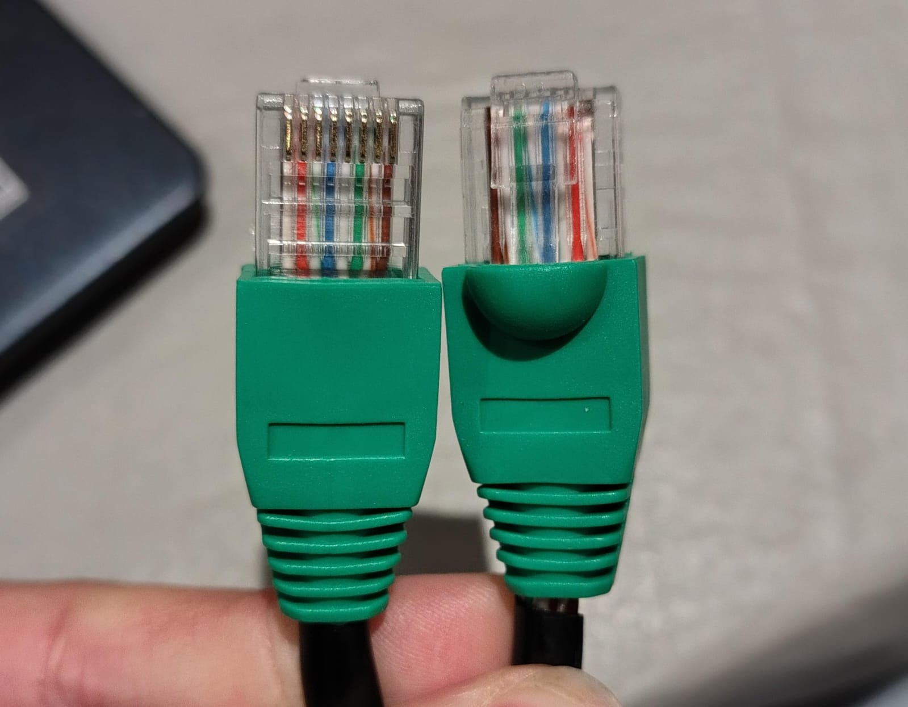
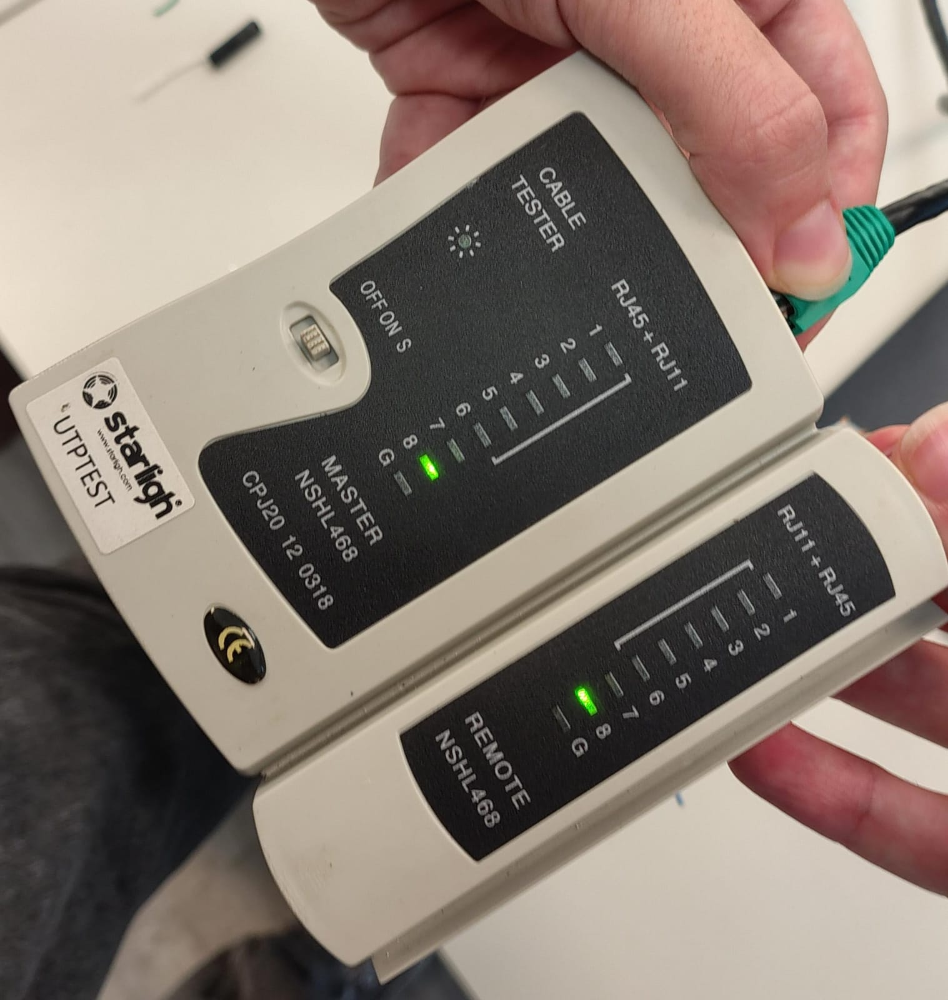
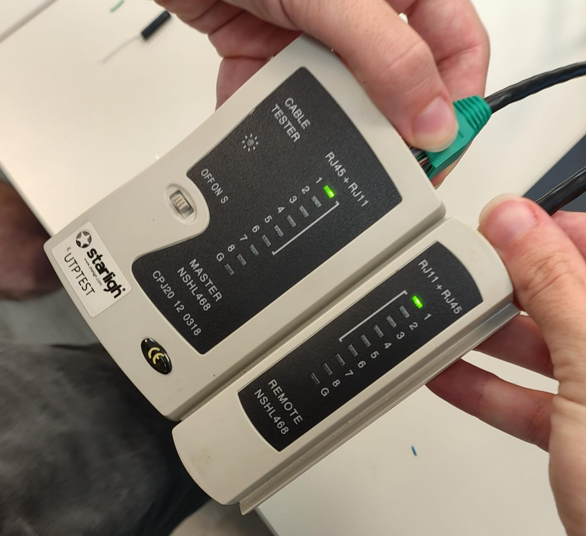
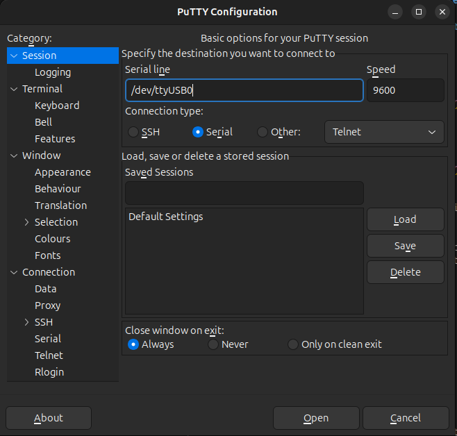
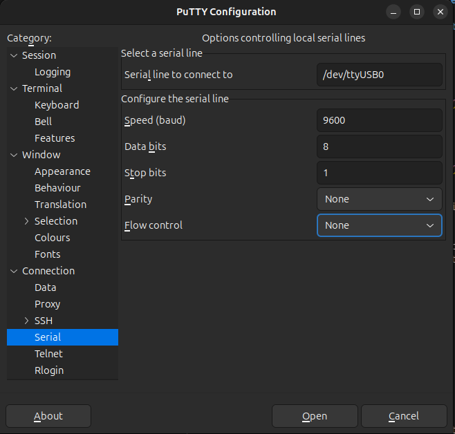
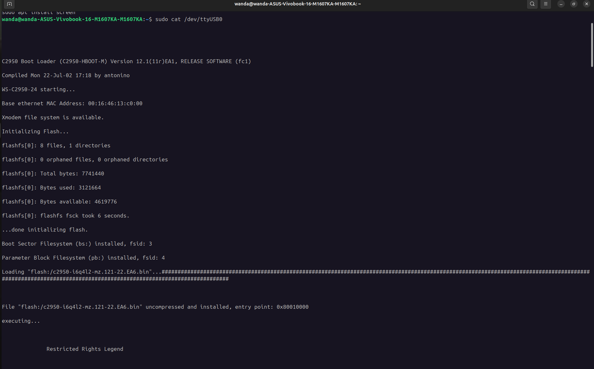
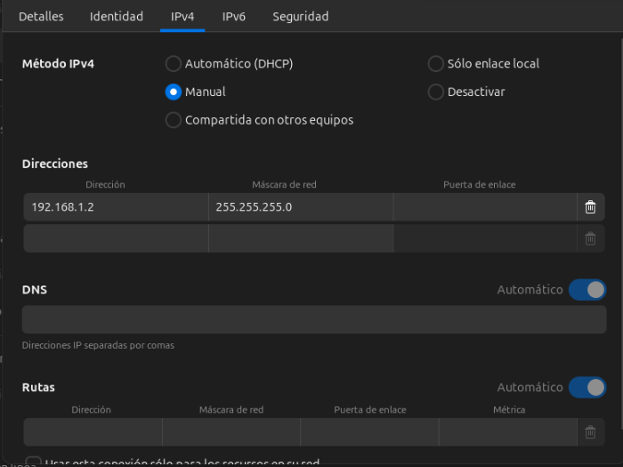
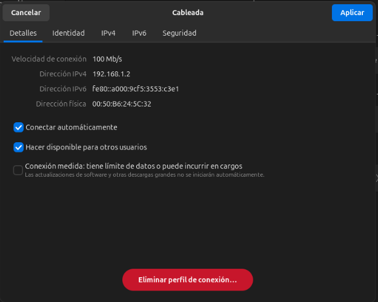
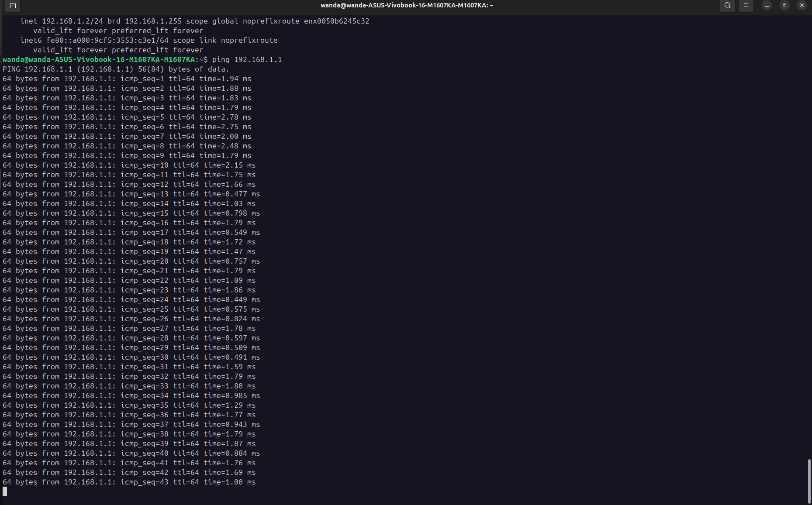

# Redes de Computadoras - Trabajo Práctico N° 2

# Simulación de envío de paquetes, ARP y ruteo entre redes

**Integrantes:**

- _Maria Wanda Molina_
- _Marcos Moran_
- _Martina Juri_
- _Francisco Gomez Neimann_

**Nombre del grupo:**

Subnet Surfers

**Nombre del centro educativo o institución:**

Facultad de Ciencias Exactas, Físicas y Naturales

**Profesores:**

Santiago M. Henn

**Materia:**

Redes de Computadoras

**Fecha:**

26 de marzo de 2026

---

### Información de los autores

- Información de contacto:

* [wanda.molina@mi.unc.edu.ar](mailto:wanda.molina@mi.unc.edu.ar)
* [mmoran@mi.unc.edu.ar](mailto:mmoran@mi.unc.edu.ar)
* [martina.juri@mi.unc.edu.ar](mailto:martina.juri@mi.unc.edu.ar)
* [francisco.gomez.neimann@mi.unc.edu.ar](mailto:francisco.gomez.neimann@mi.unc.edu.ar)

---

## Resumen

---

## Introducción

---

## Marco Teórico

---

## Resultados
### Parte 1: Armado y verificación de cable Ethernet
El objetivo de esta etapa es tomar contacto con elementos de la capa física mediante el armado y verificación de un cable Ethernet bajo norma T568A/B.

El procedimiento realizado fue el siguiente:
1. Se cortó un cable UTP de aproximadamente 1-1.5 metros.
2. Se pelaron los extremos del cable UTP.
3. Se ordenaron los pared segun la norma T568A/B.
4. Se insertaron los cables en el conector RJ45.
5. Se crimpeó utilizando la pinza crimpeadora.
6. Se repitió el procedimiento para ambos extremos (cable derecho).



_Imagen X. Cable Armado_

#### Verificación del cable
Se realizó la verificación mediante:

##### a. Inspección visual
- Correcto orden de colores
- Buena inserción en el conector
- Sin cables cortados o sueltos

##### b. Verificación eléctrica
Se utilizó un tester de cables Ethernet y resultó positivo.


_GIF X. Verificación del cable armado_

#### Intercambio con otro grupo
Intercambiamos el cable con otro grupo y confirmamos que realizaron correctamente el armado del cable.



_Imagen X. Verificación del cable armado por otro grupo (1)_



_Imagen X. Verificación del cable armado por otro grupo (2)_

### Parte 2: Uso del switch Cisco
Esta parte consiste en configurar y acceder a un switch para comprender su funcionamiento y realizar pruebas de conectividad.
Se utilizo un Switch Cisco Catalyst 2950, un cable consola (RJ45 a serial/USB), el software PuTTY y el cable Ethernet realizado en la parte 1.

#### Acceso a la consola
Se configuró PuTTY con los siguientes parámetros:
- Tipo de conexión: Serial
- Puerto: `/dev/ttyUSB0`
- Velocidad: 9600 baudios
- Data bits: 8
- Paridad: None
- Stop bits: 1
- Flow control: None



_Imagen X. Configuración de PuTTY (1)_



_Imagen X. Configuración de PuTTY (2)_

Se logró acceder correctamente a la consola del switch.

```
sudo cat /dev/ttyUSB0

C2950 Boot Loader (C2950-HBOOT-M) Version 12.1(11r)EA1, RELEASE SOFTWARE (fc1)

Compiled Mon 22-Jul-02 17:18 by antonino

WS-C2950-24 starting...

Base ethernet MAC Address: 00:16:46:13:c0:00

Xmodem file system is available.

Initializing Flash...

flashfs[0]: 8 files, 1 directories

flashfs[0]: 0 orphaned files, 0 orphaned directories

flashfs[0]: Total bytes: 7741440

flashfs[0]: Bytes used: 3121664

flashfs[0]: Bytes available: 4619776

flashfs[0]: flashfs fsck took 6 seconds.

...done initializing flash.

Boot Sector Filesystem (bs:) installed, fsid: 3

Parameter Block Filesystem (pb:) installed, fsid: 4

Loading "flash:/c2950-i6q4l2-mz.121-22.EA6.bin"...#############################################################################################################################################################################################################


File "flash:/c2950-i6q4l2-mz.121-22.EA6.bin" uncompressed and installed, entry point: 0x80010000

executing...


              Restricted Rights Legend


Use, duplication, or disclosure by the Government is

subject to restrictions as set forth in subparagraph

(c) of the Commercial Computer Software - Restricted

Rights clause at FAR sec. 52.227-19 and subparagraph

(c) (1) (ii) of the Rights in Technical Data and Computer

Software clause at DFARS sec. 252.227-7013.


           cisco Systems, Inc.

           170 West Tasman Drive

           San Jose, California 95134-1706


Cisco Internetwork Operating System Software 

IOS (tm) C2950 Software (C2950-I6Q4L2-M), Version 12.1(22)EA6, RELEASE SOFTWARE (fc1)

Copyright (c) 1986-2005 by cisco Systems, Inc.

Compiled Fri 21-Oct-05 01:59 by yenanh

Image text-base: 0x80010000, data-base: 0x80568000


Initializing flashfs...

flashfs[1]: 8 files, 1 directories

flashfs[1]: 0 orphaned files, 0 orphaned directories

flashfs[1]: Total bytes: 7741440

flashfs[1]: Bytes used: 3121664

flashfs[1]: Bytes available: 4619776

flashfs[1]: flashfs fsck took 6 seconds.

flashfs[1]: Initialization complete.

Done initializing flashfs.

POST: System Board Test : Passed

POST: Ethernet Controller Test : Passed

ASIC Initialization Passed


POST: FRONT-END LOOPBACK TEST : Passed

cisco WS-C2950-24 (RC32300) processor (revision R0) with 21013K bytes of memory.

Processor board ID FOC0947Z0ZS

Last reset from system-reset

Running Standard Image

24 FastEthernet/IEEE 802.3 interface(s)


32K bytes of flash-simulated non-volatile configuration memory.

Base ethernet MAC Address: 00:16:46:13:C0:00

Motherboard assembly number: 73-5781-13

Power supply part number: 34-0965-01

Motherboard serial number: FOC09460DE7

Power supply serial number: DAB0944J80C

Model revision number: R0

Motherboard revision number: A0

Model number: WS-C2950-24

System serial number: FOC0947Z0ZS


Press RETURN to get started!


ANGED: Interface Vlan1, changed state to administratively down


User Access Verification


Password: 

Password: 

Password: 

% Bad passwords


Cisco con0 is now available


Press RETURN to get started.


User Access Verification


Password: 

Password: 

Password: 

% Bad passwords


Cisco con0 is now available


Press RETURN to get started.


```



_Imagen X. Entrada a la consola del switch_

#### Problemas encontrados
El switch solicitaba contraseña de acceso, por lo que no fue posible acceder correctamente.

#### Conectividad entre computadoras
Utilizando otro switch y conectandose al mismo utilizando el calbe Ethernet armado, se realizo un envio de ping a otra computadora tambien conectada al switch. Se configurarion las direcciones manualmente:

| PC  | Dirección IP | Máscara       |
| --- | ------------ | ------------- |
| PC1 (otro grupo)| 192.168.1.1  | 255.255.255.0 |
| PC2 (nuestro grupo)| 192.168.1.2  | 255.255.255.0 |

_Tabla X. Configuracion de IPs con el switch_



_Imagen X. Configuracion de IP manual (1)_



_Imagen X. Configuracion de IP manual (2)_

Se comprobó la conectividad utilizando el comando `ping <IP>`, obteniendo resultados positivos.



_Imagen X. Conexión mediante ping exitosa_

Durante el ping se observó la comunicación exitosa entre los hosts conectados al swith y el correcto funcionamiento del cableado.

## Conclusión