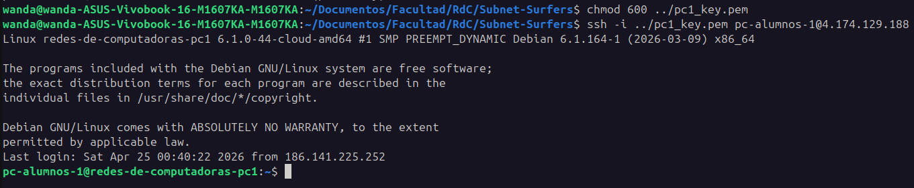
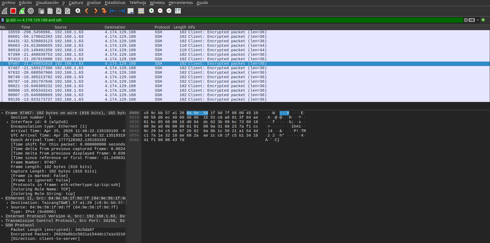
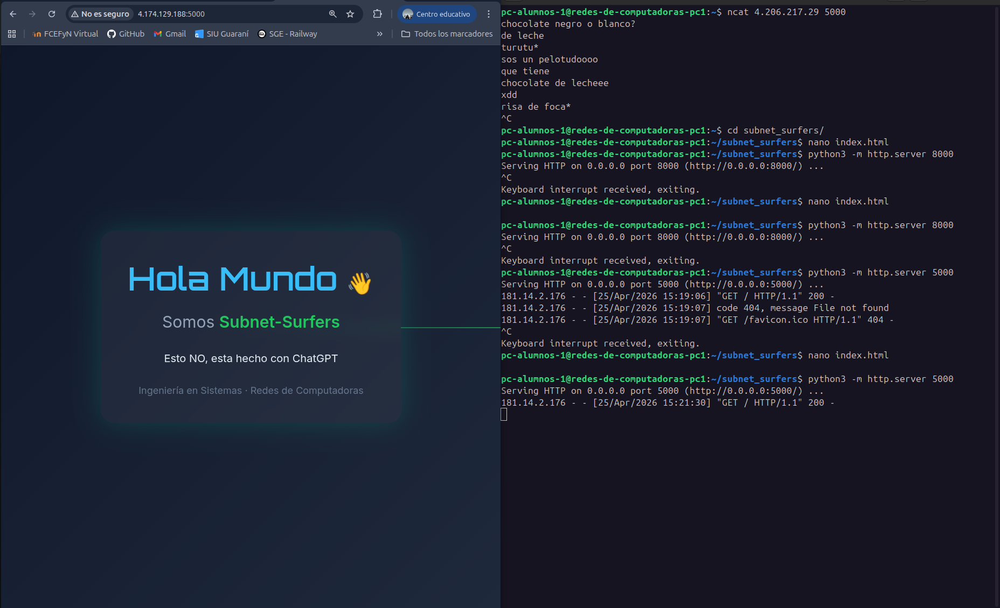

# Redes de Computadoras - Trabajo Práctico N° 3

# Introducción a infraestructura de servicios web con perspectiva de redes 

**Integrantes:**

- _Maria Wanda Molina_
- _Marcos Moran_
- _Martina Juri_
- _Francisco Gomez Neimann_

**Nombre del grupo:**

Subnet Surfers

**Nombre del centro educativo o institución:**

Facultad de Ciencias Exactas, Físicas y Naturales

**Profesores:**

Santiago M. Henn

**Materia:**

Redes de Computadoras

**Fecha:**

23 de Abril de 2026

---

### Información de los autores

- Información de contacto:

* [wanda.molina@mi.unc.edu.ar](mailto:wanda.molina@mi.unc.edu.ar)
* [mmoran@mi.unc.edu.ar](mailto:mmoran@mi.unc.edu.ar)
* [martina.juri@mi.unc.edu.ar](mailto:martina.juri@mi.unc.edu.ar)
* [francisco.gomez.neimann@mi.unc.edu.ar](mailto:francisco.gomez.neimann@mi.unc.edu.ar)

---

## Resumen
En este trabajo práctico se abordó una introducción a la infraestructura de servicios web desde una perspectiva de redes, poniendo en práctica conceptos vistos en la materia mediante el uso de máquinas virtuales en la nube, conexión remota por SSH, captura y análisis de tráfico con Wireshark, y pruebas de comunicación con netcat y HTTP. El desarrollo del trabajo permitió observar diferencias importantes entre protocolos y mecanismos de seguridad, especialmente en relación con la confidencialidad de la información transmitida. A partir de las experiencias realizadas, se pudo reconocer que algunos servicios, como SSH, protegen el contenido de la comunicación, mientras que otros, como HTTP sin cifrado o ciertas pruebas con netcat, exponen los datos y permiten su inspección en la red.

---

## Introducción
El presente trabajo práctico tiene como finalidad repasar fundamentos de acceso a infraestructura virtualizada y tomar contacto con infraestructura desplegada en la nube. Para eso, se propusieron actividades que combinan investigación conceptual y experimentación práctica sobre conexiones remotas, captura de tráfico y despliegue básico de servicios. Entre las herramientas utilizadas se encuentran SSH, Wireshark y netcat, además de un servidor HTTP simple ejecutado sobre una máquina virtual con Debian.

A lo largo del trabajo se busca no solo verificar que las conexiones funcionen, sino también analizar qué ocurre realmente en la red cuando se establece una comunicación. En ese sentido, se espera que la observación del tráfico se vincule con los contenidos teóricos de la materia, permitiendo comprender situaciones concretas como el establecimiento de conexiones TCP, el uso de UDP, la autenticación mediante claves, el acceso remoto seguro y la diferencia entre transmitir información cifrada o en texto visible. De esta manera, el práctico se orienta tanto a comprender el funcionamiento de los servicios como a reflexionar sobre la confidencialidad y la seguridad en redes de computadoras.

---

## Marco Teórico
Desde el punto de vista de la materia, un sistema de comunicación implica el intercambio de información entre entidades a través de un medio de transmisión, donde intervienen distintos mecanismos y protocolos para que los datos lleguen de forma correcta. En este marco, las comunicaciones de datos y las arquitecturas de protocolos permiten organizar el intercambio entre sistemas, tanto en redes locales como en redes más amplias, y constituyen la base para entender el funcionamiento de servicios como SSH o HTTP.

Uno de los ejes del trabajo es el uso de **SSH** para acceder de forma remota a una máquina virtual. Este tipo de acceso se vincula con la necesidad de administrar sistemas a distancia de manera segura. En el plano teórico, esto se relaciona con la seguridad en redes, particularmente con mecanismos de cifrado y autenticación. **Stallings** distingue las amenazas pasivas, orientadas a obtener información de una comunicación, de las amenazas activas, orientadas a modificar datos o generar transmisiones falsas; por eso el cifrado y la autenticación cumplen funciones centrales al momento de proteger el intercambio de información.

En relación con esto, es importante diferenciar **cifrado** y **autenticación**. El cifrado apunta a preservar la privacidad del contenido transmitido, impidiendo que terceros puedan interpretarlo fácilmente. La autenticación, en cambio, busca verificar el origen o legitimidad de una entidad o mensaje. En el material de Stallings ambos conceptos aparecen tratados como funciones distintas dentro de la seguridad de red: por un lado la privacidad mediante cifrado, y por otro la autenticación de mensajes y las firmas digitales.

En la parte práctica se utilizara **Wireshark** y **netcat** para observar el tráfico de red. El uso de estas herramientas se relaciona con el estudio de protocolos de transporte y con el análisis de cómo circulan los datos en una comunicación. El TP propone capturar tráfico SSH, conexiones TCP y UDP, y también tráfico HTTP generado por un servidor simple desplegado con Python. Esto permite comparar distintos casos: cuando la comunicación se encuentra protegida, el contenido no puede interpretarse directamente en la captura; en cambio, cuando se trata de protocolos sin cifrado, como HTTP en este contexto, los datos pueden observarse con mayor facilidad. 

Finalmente, el despliegue de un servidor HTTP sencillo dentro de la VM permite vincular lo trabajado con la idea de servicios web básicos funcionando sobre la arquitectura de red. Al acceder desde la PC local al recurso publicado en la máquina virtual, se pone en juego la relación entre aplicación, transporte y red, a la vez que se evidencian cuestiones de seguridad: si el tráfico HTTP se transmite sin cifrado, el contenido puede ser inspeccionado e incluso potencialmente alterado por un tercero con acceso al canal. Por eso, uno de los aportes principales de este trabajo no fue solo poner en funcionamiento herramientas y servicios, sino también comprender por qué la confidencialidad y la protección del tráfico son aspectos fundamentales en redes de computadoras.

---

## Investigación conceptual

1) ¿Qué es SSH y qué problema resuelve? 
    SSH es un protocolo de red que permite el acceso remoto seguro a otro equipo mediante una conexión cifrada. Resuelve el problema de que se filtren las credenciales de acceso o datos transmitidos entre los equipos como sucede con los protocolos no cifrados como Telnet o FTP.

2) Diferencia entre autenticación y cifrado
    La autenticación sirve para verificar la identidad de un usuario o dispositivo, mientras que el cifrado se utiliza para proteger los datos transmitidos entre dos partes, asegurando que solo el destinatario previsto pueda leerlos.

3) ¿Qué es una clave pública y una clave privada? 
    La clave pública y la clave privada un par de claves de un sistema de cifrado asimétrico: la clave pública puede difundirse y la privada debe mantenerse en secreto. Lo que se cifra o firma con una (clave privada) se verifica o descifra con la otra (clave pública).

4) ¿Por qué la clave privada no debe compartirse? 
    La clave privada no debe compartirse porque es el dato secreto que permite descifrar mensajes dirigidos al dueño y generar firmas digitales en su nombre, si otra persona la conoce, se pierde la confidencialidad y la autenticidad.

5) ¿Qué ventajas tienen las claves SSH frente a contraseñas?
    Las claves SSH ofrecen mayor seguridad y comodidad que las contraseñas, porque son más resistentes a ataques, no dependen de secretos fáciles de adivinar y permiten autenticación robusta sin exponer credenciales de forma tradicional.

---

## Análisis del video de Veritasium
**a) Relación del problema del video con los TPs 1, 2 y 3**

El problema abordado en el video se relaciona directamente con varios de los conceptos trabajados en los trabajos prácticos anteriores, especialmente con la transmisión segura de información en redes, la integridad de los datos y la confidencialidad de las comunicaciones.

En primer lugar, puede vincularse con el TP 1, donde se estudió cómo viajan los paquetes a través de la red, pasando por distintos nodos intermedios mediante un esquema de ruteo hop-by-hop. En el video se evidencia que la comunicación entre el dispositivo móvil, la terminal de pago y los servidores de validación también depende de una secuencia de intercambios de mensajes a través de la red. Es decir, la transacción no ocurre “directamente”, sino que involucra múltiples sistemas intermedios, de forma análoga al recorrido de paquetes IP visto en el laboratorio.

Por otro lado, la situación también se relaciona con la parte 2 del TP 1, referida a la detección e integridad de errores (EDAC). Allí aprendimos que no solo importa que la información llegue, sino que además debe mantenerse íntegra y poder validarse. En el caso mostrado por el video, el problema no es un error físico de bits, sino una falla lógica en la validación del mensaje transmitido. Es decir, el sistema acepta una operación que no debería considerarse válida, lo cual demuestra que además de detectar errores en los datos, es fundamental verificar correctamente la legitimidad del mensaje y su contexto.

Finalmente, la relación más directa aparece con el TP 3, donde trabajamos con SSH, HTTP, Wireshark y confidencialidad. En ese laboratorio observamos que algunas comunicaciones pueden ser inspeccionadas fácilmente cuando no están cifradas, mientras que protocolos como SSH protegen el contenido. El video demuestra precisamente la importancia de la seguridad en las comunicaciones: aunque los datos puedan viajar correctamente, si existe una vulnerabilidad en cómo se autentican o validan las transacciones, el sistema sigue siendo inseguro.

En síntesis, se aplican directamente los siguientes conceptos aprendidos:

transmisión de información a través de redes
paso por múltiples sistemas intermedios
validación e integridad de los mensajes
autenticación de entidades
confidencialidad de la comunicación
seguridad lógica además de seguridad física del canal

**b) Consideraciones según el principio de confidencialidad y los resultados del laboratorio**

A partir del principio de confidencialidad en redes de computadoras, el video pone en evidencia que no alcanza únicamente con cifrar la comunicación.

En el TP 3 observamos que protocolos como SSH protegen el contenido transmitido, evitando que terceros puedan leer credenciales o mensajes mediante herramientas como Wireshark. Sin embargo, el caso mostrado en el video demuestra que incluso si la información viaja cifrada, pueden existir vulnerabilidades en la lógica de autenticación y autorización.

Por lo tanto, además de la confidencialidad, se deben considerar otros principios fundamentales de seguridad:

- _autenticación:_ verificar que quien inicia la operación sea realmente el usuario legítimo
- _integridad:_ asegurar que los mensajes no sean modificados
- _autorización:_ validar que la operación esté permitida
- _no repudio / trazabilidad:_ registrar correctamente quién realizó la acción

A partir de los resultados obtenidos en el laboratorio, también debemos tener en cuenta que:

- protocolos sin cifrado exponen información sensible
- los datos visibles en red pueden ser interceptados
- una mala implementación de seguridad puede comprometer el sistema incluso usando cifrado
- la seguridad depende tanto del protocolo como de la lógica de aplicación

En conclusión, el video refuerza una idea central de la materia: la seguridad en redes no depende solamente del transporte de los datos, sino también de cómo los sistemas interpretan, validan y autorizan la información que reciben.

## Resultados

### 2) Verificación de conexión SSH con la VM

Se realizó el acceso remoto a la máquina virtual utilizando el protocolo SSH y una clave privada previamente generada.

El comando utilizado fue:

```bash
ssh -i <path/a/la/clave> <usuario>@<ip>
```
La conexión se estableció correctamente, permitiendo acceder a la terminal de la VM Debian desplegada en la nube.

Una vez dentro de la máquina virtual, se creó la carpeta correspondiente al grupo Subnet Surfers, cumpliendo con la consigna solicitada.


_Imagen 1. Acceso remoto a la máquina virtual mediante SSH_

.png)
_Imagen 2. Creación de la carpeta del grupo dentro de la VM_

Esta experiencia permitió comprobar el funcionamiento del acceso remoto seguro y verificar el uso de autenticación mediante claves.

### 3) Captura y análisis de tráfico SSH

Se utilizó Wireshark para capturar el tráfico generado durante la conexión SSH.


_Imagen 3. Captura de tráfico SSH en Wireshark_

En la captura se puede observar el intercambio de paquetes correspondiente al establecimiento y mantenimiento de la sesión SSH.

Sin embargo, el contenido de los mensajes no puede ser interpretado en texto legible, ya que SSH utiliza cifrado extremo a extremo.

Esto confirma experimentalmente uno de los principales objetivos del protocolo: proteger la confidencialidad de la información transmitida.

Por lo tanto, aunque los paquetes son visibles en la red, no es posible descifrar su contenido sin las claves correspondientes.

### 4) Comunicación con netcat
**a) Comunicación TCP**

Se montó un servidor TCP en la máquina virtual utilizando netcat:

```bash
ncat -l <puerto>
```

Posteriormente, desde la computadora local se estableció la conexión:

```bash
ncat <VM_IP> <PUERTO>
```

Durante este proceso se capturó el three-way handshake TCP.

.png)
_Imagen 4. Establecimiento de conexión TCP (SYN, SYN-ACK, ACK)_

En esta captura se observa claramente:

* **SYN:** solicitud de conexión
* **SYN-ACK:** aceptación del servidor
* **ACK:** confirmación final

Luego se enviaron mensajes entre ambos extremos.

.png)
_Imagen 5. Mensaje enviado desde local hacia la VM mediante TCP_

.png)
_Imagen 6. Respuesta desde la VM hacia el equipo local_

El contenido pudo observarse en Wireshark debido a que la comunicación mediante netcat sobre TCP no aplica cifrado por defecto.

Esto demuestra que el **protocolo de transporte asegura entrega confiable, pero no confidencialidad**.

**b) Comunicación UDP**

Se repitió la experiencia utilizando protocolo UDP.

.png)
_Imagen 7. Comunicación mediante UDP_

En este caso no se observa handshake previo, ya que UDP es un protocolo no orientado a conexión.

Los datagramas fueron visibles en ambos sentidos, pudiendo leerse el contenido de forma directa.

Esto permitió comparar experimentalmente las diferencias entre:

* **TCP:** conexión confiable y orientada a sesión
* **UDP:** transmisión directa sin confirmación

**c) Comunicación entre dos VMs**

Se estableció comunicación entre dos máquinas virtuales distintas utilizando netcat.

.png)
_Imagen 8. Intercambio de mensajes entre instancias virtuales_

Se documentó un ida y vuelta de mensajes tipo chat entre ambas instancias, verificando la conectividad entre nodos dentro de la infraestructura en la nube.

Esta actividad permitió observar una comunicación host a host completamente remota.

### 5) Servidor HTTP simple

Se creó un archivo index.html dentro de la carpeta del grupo y luego se desplegó un servidor HTTP con:

```bash
python3 -m http.server 8000
```


_Imagen 9. Archivo HTML creado en la VM_

Posteriormente se accedió desde la computadora local mediante navegador:
```bash
http://<VM_IP>:8000
```
Durante la captura con Wireshark se observaron claramente las solicitudes HTTP realizadas por el navegador.

.png)
_Imagen 10. Acceso al servidor HTTP desde navegador_

La captura en Wireshark mostró claramente el tráfico HTTP.

.png)
_Imagen 11. Solicitud HTTP GET del recurso principal (/)_
En esta captura puede observarse en texto plano la solicitud:

```bash
GET / HTTP/1.1
```
junto con información adicional como:

- dirección IP destino
- puerto utilizado
- cabecera Host
- User-Agent
- tipos de contenido aceptados


.png)
_Imagen 12. Solicitud adicional de recurso (/favicon.ico)_

En este caso, el contenido del archivo HTML puede observarse completamente en texto plano.

Esto implica que:

* sí puede descifrarse el contenido
* sí podría ser interceptado
* potencialmente podría ser alterado por un tercero

Este resultado contrasta directamente con lo observado en SSH.

## Conclusión

El desarrollo del trabajo práctico permitió comparar distintos protocolos y mecanismos de comunicación desde una perspectiva de seguridad en redes.

Se comprobó experimentalmente que:

* SSH protege la confidencialidad mediante cifrado
* TCP y UDP transmiten datos visibles si no se cifra la aplicación
* HTTP transmite contenido en texto plano
* Wireshark permite inspeccionar protocolos no cifrados

A partir de estas experiencias, se concluye que la seguridad no depende únicamente de la conectividad, sino del protocolo y de los mecanismos de protección implementados sobre la comunicación.

