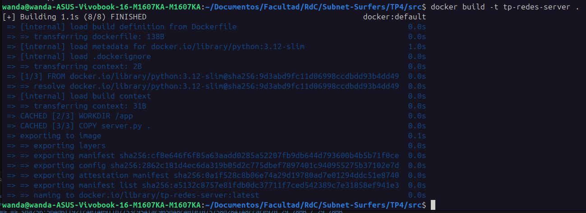
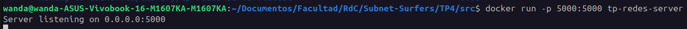
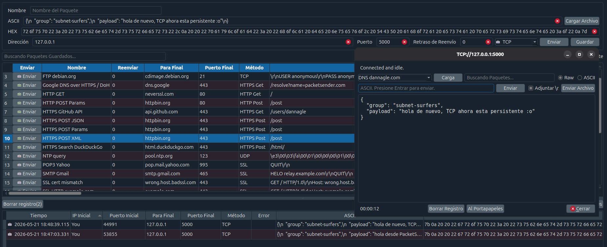
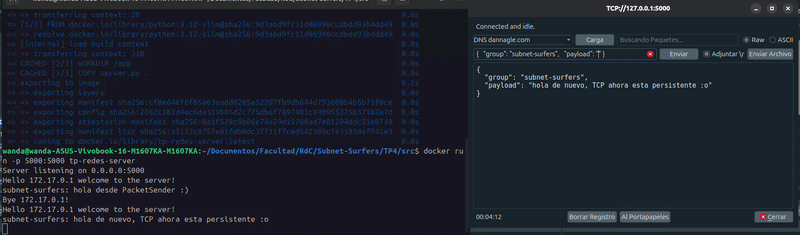
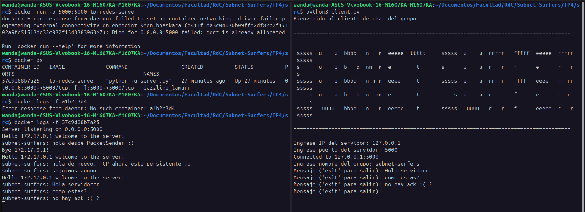
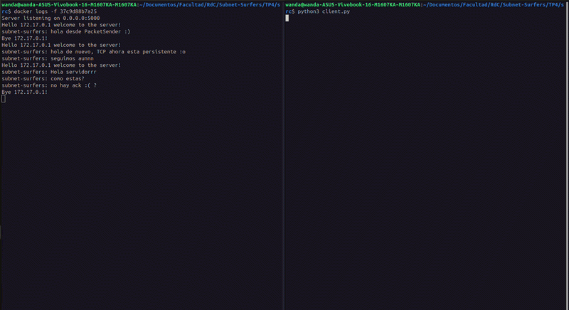
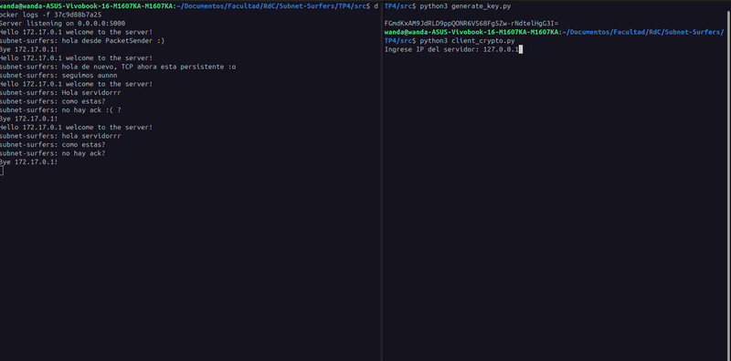
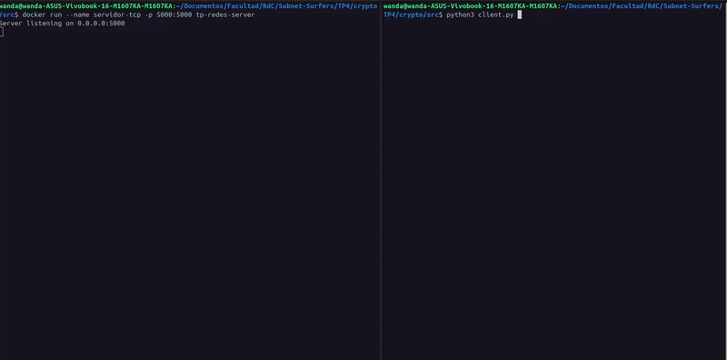

# Redes de Computadoras - Trabajo Práctico N° 4

# Implementación de comunicación cliente-servidor segura mediante sockets TCP

**Integrantes:**

* *Maria Wanda Molina*
* *Marcos Moran*
* *Martina Juri*
* *Francisco Gomez Neimann*

**Nombre del grupo:**

Subnet Surfers

**Nombre del centro educativo o institución:**

Facultad de Ciencias Exactas, Físicas y Naturales

**Profesores:**

Santiago M. Henn

**Materia:**

Redes de Computadoras

**Fecha:**

21 de Mayo de 2026

---
### Información de los autores

- Información de contacto:

* [wanda.molina@mi.unc.edu.ar](mailto:wanda.molina@mi.unc.edu.ar)
* [mmoran@mi.unc.edu.ar](mailto:mmoran@mi.unc.edu.ar)
* [martina.juri@mi.unc.edu.ar](mailto:martina.juri@mi.unc.edu.ar)
* [francisco.gomez.neimann@mi.unc.edu.ar](mailto:francisco.gomez.neimann@mi.unc.edu.ar)


## Resumen

En el presente trabajo práctico se desarrolló un sistema básico de comunicación cliente-servidor utilizando sockets TCP en Python. A lo largo de las distintas actividades se implementó un servidor concurrente capaz de aceptar múltiples conexiones, un cliente interactivo configurable desde consola y un mecanismo de serialización de mensajes mediante JSON.

Posteriormente se incorporó una capa de seguridad utilizando cifrado simétrico sobre la carga útil de los mensajes, implementando técnicas de cifrado y descifrado mediante la librería Cryptography y el esquema Fernet.

El trabajo permitió integrar conceptos de programación de sockets, transporte TCP, serialización de datos, concurrencia, virtualización mediante Docker y seguridad en comunicaciones.


## Introducción

Las aplicaciones cliente-servidor constituyen uno de los modelos fundamentales sobre los cuales se construyen gran parte de los servicios de red modernos. En este esquema, un servidor permanece a la espera de solicitudes provenientes de distintos clientes, estableciendo canales de comunicación mediante protocolos de transporte como TCP.

En este trabajo práctico se buscó implementar una aplicación real de intercambio de mensajes utilizando sockets TCP en Python, poniendo especial atención tanto al funcionamiento de la comunicación como a los aspectos relacionados con la seguridad de la información transmitida.

Inicialmente se desarrolló un servidor concurrente capaz de aceptar múltiples conexiones utilizando threads, junto con un cliente configurable desde consola que serializa los mensajes en formato JSON antes de enviarlos a través de la red.

Posteriormente se incorporó un mecanismo de cifrado simétrico para proteger exclusivamente la carga útil de los mensajes, permitiendo observar experimentalmente cómo los datos transmitidos dejan de ser legibles durante el tránsito por la red. Finalmente, mediante el uso de Docker, se verificó tanto el funcionamiento de la aplicación como la presencia de tráfico cifrado durante la comunicación.


## Marco Teórico

Desde el punto de vista de redes de computadoras, las aplicaciones distribuidas requieren mecanismos de comunicación que permitan intercambiar información entre procesos ejecutándose en distintos hosts. Para ello, los sistemas operativos proveen interfaces de comunicación denominadas sockets, las cuales permiten a las aplicaciones interactuar con los protocolos de transporte.

En este trabajo se utilizó el protocolo TCP, un protocolo orientado a conexión que proporciona entrega confiable de datos, control de flujo y control de errores. TCP establece previamente una conexión mediante el conocido three-way handshake antes de permitir el intercambio de información entre cliente y servidor.

Sobre esta capa de transporte se implementó una arquitectura cliente-servidor. El servidor desarrollado permanece escuchando conexiones entrantes en un puerto específico, mientras que los clientes establecen conexiones activas hacia dicho servicio para transmitir mensajes.

Para representar estructuradamente la información transmitida se utilizó serialización JSON. Este mecanismo permite convertir estructuras de datos complejas en texto intercambiable entre aplicaciones, facilitando la interoperabilidad y el procesamiento de mensajes.

Otro de los conceptos fundamentales abordados en el trabajo fue la seguridad de las comunicaciones. Inicialmente, los mensajes transmitidos viajaban en texto plano. Posteriormente se incorporó cifrado simétrico utilizando Fernet, perteneciente a la librería Cryptography para Python.

Fernet implementa cifrado autenticado utilizando algoritmos criptográficos modernos basados en AES y HMAC, proporcionando confidencialidad e integridad sobre los datos transmitidos. En este esquema, tanto cliente como servidor comparten una misma clave secreta utilizada para cifrar y descifrar la información.

Finalmente, el trabajo también incorporó conceptos básicos de virtualización y despliegue de servicios mediante Docker. El servidor fue ejecutado dentro de un contenedor aislado, permitiendo separar el entorno de ejecución y simplificar la administración de dependencias y puertos de red.


## Investigación conceptual

1) ¿Qué es la serialización en redes de computadoras?

La serialización es el proceso mediante el cual una estructura de datos utilizada internamente por una aplicación se transforma en un formato transmisible o almacenable. En redes de computadoras, esto permite convertir objetos, diccionarios, listas o estructuras complejas en una secuencia de bytes que pueda viajar a través de un protocolo de comunicación.

Cuando un cliente desea enviar información a un servidor, los datos deben representarse de una forma entendible por ambos extremos. La serialización cumple precisamente esta función: transformar estructuras de memoria en datos intercambiables.

En este trabajo práctico se utilizó serialización JSON, permitiendo representar los mensajes mediante pares clave-valor fácilmente interpretables tanto por el cliente como por el servidor.

Sin serialización, el receptor no tendría forma de interpretar correctamente la información enviada, ya que los datos internos de memoria dependen del lenguaje y de la implementación de cada sistema.

2) Diferencia entre serialización binaria y no binaria

La serialización puede clasificarse en binaria y no binaria según el formato final utilizado para representar los datos.

**Serialización no binaria**

La serialización no binaria utiliza formatos legibles para humanos, generalmente basados en texto plano. Algunos ejemplos son:

- JSON
- XML
- YAML
- CSV

En este trabajo práctico se utilizó JSON debido a su simplicidad y amplia compatibilidad.

***Ventajas***
- legibilidad humana
- facilidad de depuración
- interoperabilidad entre lenguajes
- amplia adopción en aplicaciones web y APIs

***Desventajas*** 
- mayor tamaño de los mensajes
- menor eficiencia
- mayor consumo de ancho de banda
- procesamiento más lento comparado con formatos binarios

**Serialización binaria**
La serialización binaria representa la información directamente en bytes, evitando estructuras textuales legibles.

Ejemplos:

- Protocol Buffers
- BSON
- MessagePack
- Avro

En este caso, los datos transmitidos no pueden interpretarse fácilmente sin conocer el protocolo de codificación utilizado.

***Ventajas***
- menor tamaño de transmisión
- mayor eficiencia
- menor consumo de ancho de banda
- procesamiento más rápido

***Desventajas***
- dificultad de lectura humana
- depuración más compleja
- menor transparencia del tráfico
- dependencia de esquemas específicos


## Estructura del proyecto

El repositorio fue organizado en dos implementaciones separadas:

```text
.
├── src/
│   ├── server.py
│   ├── client.py
│   └── Dockerfile
│
├── crypto/
│   └── src/
│       ├── server.py
│       ├── client.py
│       ├── generate_key.py
│       └── Dockerfile
```

Donde:

- `src/` contiene la implementación base del sistema cliente-servidor utilizando sockets TCP y mensajes JSON sin mecanismos de seguridad.
- `crypto/src/` contiene la implementación extendida incorporando cifrado simétrico mediante Fernet sobre la carga útil de los mensajes.

## Desarrollo práctico

### Parte I - Comunicación TCP sin cifrado

#### 1) Implementación del servidor TCP

Se desarrolló un servidor TCP utilizando Python y sockets. El servidor escucha conexiones entrantes sobre el puerto 5000 y acepta múltiples clientes simultáneamente mediante el uso de threads.

El servidor implementa:

* aceptación de conexiones TCP
* concurrencia mediante threading
* recepción de mensajes serializados en JSON
* validación estructural del mensaje
* manejo de desconexiones

El formato definido para los mensajes fue:

```json
{
  "group": "nombre_del_grupo",
  "payload": "mensaje"
}
```

##### Código del servidor (`src/server.py`)

```python
# Fragmento representativo del servidor
server_socket.bind((HOST, PORT))
server_socket.listen()

client_thread = threading.Thread(
    target=handle_client,
    args=(client_socket, client_address)
)
```

---

#### 2) Despliegue mediante Docker

Para virtualizar el entorno de ejecución del servidor se utilizó Docker.

Se creó un Dockerfile basado en Python 3.12 slim, exponiendo el puerto 5000 correspondiente al servicio TCP.

La implementación básica fue desplegada utilizando el contenido de `/src/Dockerfile`:

##### Dockerfile utilizado

```dockerfile
FROM python:3.12-slim

WORKDIR /app

COPY server.py .

EXPOSE 5000

CMD ["python", "-u", "server.py"]
```

La imagen fue construida mediante:

```bash
docker build -t tp-redes-server .
```

y ejecutada utilizando:

```bash
docker run --name servidor-tcp -p 5000:5000 tp-redes-server
```



*Imagen 1. Build de la imagen del servidor en Docker*



*Imagen 2. Servidor corriendo en Docker*

En primera instacia se probo la conexion al servidor utilizando Packet Sender:



*Imagen 3. Envio de payload mediante Packet Sender*

Se selecciono la opcion de TCP persistente, de manera que la comunicacion se mantenia activa. Esta opcion abria la ventana que se ve a la derecha, permitiendo enviar un nuevo payload. En la siguiente demostracion podemos ver esto mismo:



*GIF 1. Envio de payload mediante Packet Sender persistente*

---

#### 3) Desarrollo del cliente TCP

Se desarrolló un cliente interactivo en Python capaz de:

* configurar IP y puerto de destino
* conectarse al servidor
* serializar mensajes en JSON
* enviar múltiples mensajes durante una sesión

El cliente solicita los datos desde consola y mantiene la conexión activa hasta que el usuario decide finalizarla.

##### Código del cliente (`src/client.py`)

```python
HOST = input("Ingrese IP del servidor: ")
PORT = int(input("Ingrese puerto del servidor: "))
```

```python
message = {
    "group": group_name,
    "payload": text
}
```

##### Verificación de funcionamiento

Se verificó experimentalmente que los mensajes enviados desde el cliente llegaban correctamente al servidor.



*Imagen 4. Conexion con el servidor*



*GIF 2. Conexion con el servidor*

---

### Parte II - Implementación de seguridad

La segunda etapa del trabajo fue implementada dentro del directorio `/crypto/src`.

Esta versión incorpora mecanismos de seguridad sobre la comunicación TCP previamente desarrollada.

#### 4) Cifrado de la carga útil

Posteriormente se incorporó un mecanismo de seguridad sobre la comunicación.

La consigna requería cifrar exclusivamente el campo `payload` del mensaje, manteniendo visible el resto de la estructura JSON.

Para ello se utilizó cifrado simétrico mediante Fernet de la librería Cryptography.

Fernet es un esquema de cifrado autenticado incluido dentro de la librería Cryptography para Python. Internamente utiliza:

- AES (Advanced Encryption Standard) para cifrado
- HMAC (Hash-based Message Authentication Code) para integridad
- claves simétricas compartidas entre cliente y servidor

A diferencia de mecanismos más simples, Fernet no solo protege la confidencialidad de los datos, sino también su integridad, permitiendo detectar modificaciones no autorizadas sobre el mensaje transmitido.

En un esquema de cifrado simétrico, tanto el emisor como el receptor utilizan exactamente la misma clave secreta para cifrar y descifrar la información.

El proceso implementado en el trabajo fue:

1. El cliente genera el mensaje JSON.
2. El campo payload es cifrado utilizando la clave compartida.
3. El mensaje cifrado se serializa nuevamente.
4. El servidor recibe el mensaje.
5. El servidor descifra únicamente el payload.
6. Finalmente se recupera el contenido original.

Esto permitió proteger exclusivamente la información sensible mientras que el resto de la estructura del mensaje permaneció visible para fines de procesamiento.

##### Generación de clave

Se generó una clave compartida entre cliente y servidor:

```python
from cryptography.fernet import Fernet

key = Fernet.generate_key()
```

##### Cifrado del payload

Antes de enviar cada mensaje, el cliente cifra el contenido:

```python
encrypted_payload = cipher.encrypt(
    text.encode("utf-8")
).decode("utf-8")
```

El mensaje transmitido adquiere una estructura similar a:

```json
{
  "group": "Subnet Surfers",
  "payload": "gAAAAABqD4..."
}
```

##### Verificación de cifrado

El servidor recibió correctamente mensajes cuyo contenido ya no era legible en texto plano.



*GIF 3. Conexion con el servidor con encriptacion en el payload*

El cliente utilizado se encuentra en `crypto/src/client.py`. En la captura, se esta utilizando con otro nombre en el directorio `/src` para hacer uso del servidor sin desencriptador.

---

#### 5) Descifrado del lado servidor

Finalmente se modificó el servidor para incorporar el descifrado automático del payload recibido.

Utilizando la misma clave compartida, el servidor logra recuperar el mensaje original:

```python
decrypted_payload = cipher.decrypt(
    encrypted_payload.encode("utf-8")
).decode("utf-8")
```

La salida del servidor muestra simultáneamente:

* mensaje cifrado recibido
* mensaje original descifrado

Esto permitió verificar experimentalmente que la información sensible ya no circula en texto plano a través de la red.



*GIF 4. Conexion cliente - servidor con encriptacion*

---

### Resultados obtenidos

A partir del desarrollo realizado se logró:

- implementar un servidor TCP concurrente
- establecer comunicación cliente-servidor mediante sockets
- serializar mensajes utilizando JSON
- desplegar el servidor dentro de Docker
- implementar cifrado simétrico sobre la carga útil
- descifrar mensajes correctamente en el servidor
- mantener sesiones TCP persistentes
- analizar tráfico utilizando herramientas de inspección de red

Durante las pruebas experimentales se verificó que:

- el servidor podía aceptar múltiples mensajes dentro de una misma conexión TCP,
- la serialización JSON permitía estructurar correctamente la información transmitida,
- el tráfico sin cifrado podía interpretarse fácilmente,
- el cifrado Fernet protegía exitosamente la carga útil,
- y el servidor era capaz de recuperar el mensaje original utilizando la clave compartida.

También se observó que Docker simplificó significativamente el despliegue del entorno de ejecución, permitiendo aislar dependencias y mantener configuraciones reproducibles.

En términos de seguridad, el trabajo permitió evidenciar experimentalmente la diferencia entre:

- transporte confiable,
- y transmisión protegida criptográficamente.

Esto resulta especialmente importante en aplicaciones distribuidas modernas donde la confidencialidad de la información constituye un requisito fundamental.


## Conclusión

El trabajo práctico permitió integrar múltiples conceptos fundamentales de redes de computadoras mediante el desarrollo completo de una aplicación cliente-servidor funcional basada en sockets TCP.

A lo largo de las actividades se abordaron aspectos relacionados con:

- programación de sockets,
- comunicación cliente-servidor,
- concurrencia mediante threads,
- serialización de datos,
- virtualización mediante Docker,
- y seguridad en comunicaciones.

La separación entre una implementación base y otra con mecanismos de seguridad permitió comparar experimentalmente el comportamiento del tráfico antes y después de incorporar cifrado sobre la aplicación.

Uno de los resultados más relevantes fue comprobar que TCP garantiza entrega confiable de información, pero no protege por sí mismo la confidencialidad de los datos transmitidos. En la primera implementación, los mensajes podían observarse en texto plano durante el tránsito por la red. Posteriormente, al incorporar cifrado Fernet, el contenido dejó de ser interpretable para terceros, aunque el servidor continuó siendo capaz de recuperar correctamente la información original utilizando la clave compartida.

Finalmente, el trabajo permitió comprender que la seguridad en redes no depende únicamente del protocolo de transporte utilizado, sino también de las técnicas implementadas a nivel de aplicación para proteger la información intercambiada entre sistemas distribuidos.
