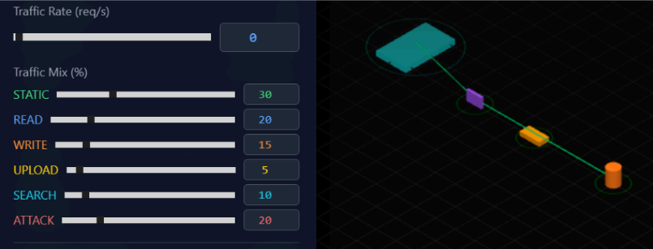
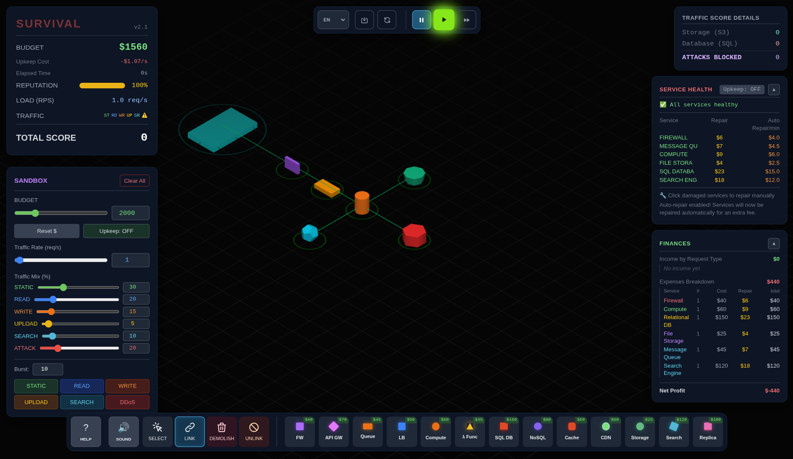
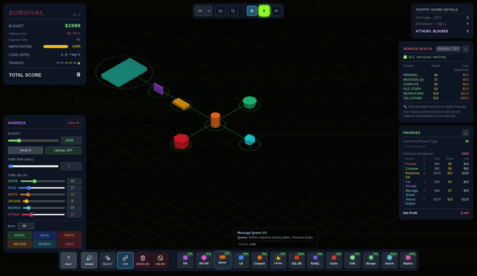
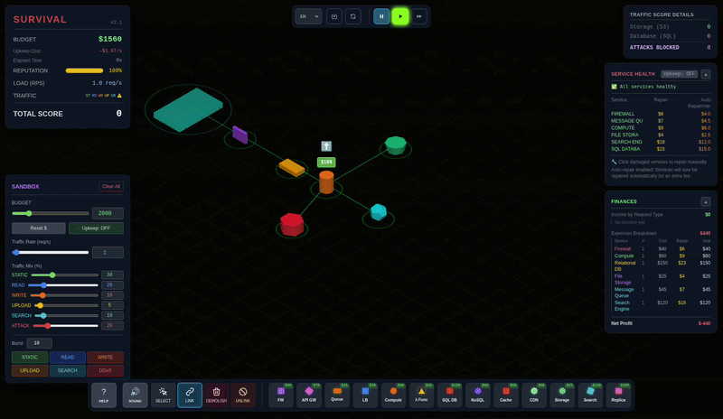
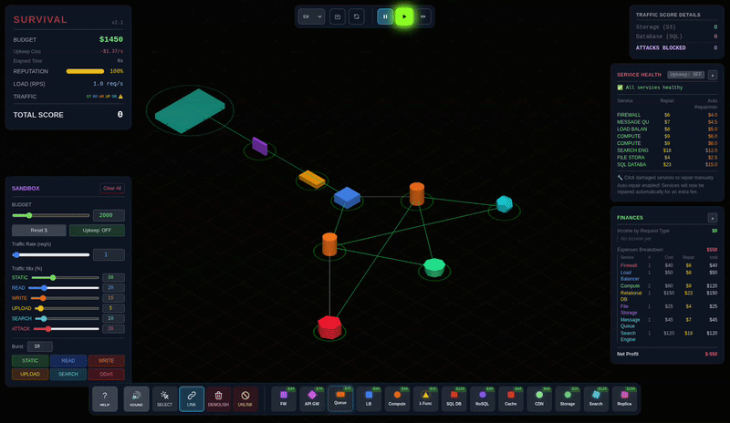

# Redes de Computadoras - Trabajo Práctico N° 5

# Análisis de tráfico de red de una arquitectura de servicios

**Integrantes:**

* *Maria Wanda Molina*
* *Marcos Moran*
* *Martina Juri*
* *Francisco Gomez Neimann*

**Nombre del grupo:**

Subnet Surfers

**Nombre del centro educativo o institución:**

Facultad de Ciencias Exactas, Físicas y Naturales

**Profesores:**

Santiago M. Henn

**Materia:**

Redes de Computadoras

**Fecha:**

7 de junio de 2026

---
### Información de los autores

- Información de contacto:

* [wanda.molina@mi.unc.edu.ar](mailto:wanda.molina@mi.unc.edu.ar)
* [mmoran@mi.unc.edu.ar](mailto:mmoran@mi.unc.edu.ar)
* [martina.juri@mi.unc.edu.ar](mailto:martina.juri@mi.unc.edu.ar)
* [francisco.gomez.neimann@mi.unc.edu.ar](mailto:francisco.gomez.neimann@mi.unc.edu.ar)

# Resumen

El presente trabajo práctico tiene como finalidad analizar el comportamiento de una arquitectura de servicios frente a distintos tipos de tráfico mediante el uso del simulador **Server Survival**. A través de este entorno, se busca comprender cómo componentes como firewall, balanceadores de carga, colas, servidores de cómputo, bases de datos, caché, CDN, almacenamiento y réplicas intervienen en el procesamiento de solicitudes reales.

Durante el desarrollo del trabajo se identifican los componentes principales de una infraestructura cloud, se los relaciona con las capas del modelo TCP/IP y se evalúa su comportamiento ante tráfico estático, lecturas, escrituras, cargas de archivos, búsquedas y tráfico malicioso. Además, se realizan pruebas de escalabilidad para observar fallas, cuellos de botella y decisiones de diseño que pueden afectar el rendimiento, la seguridad y la disponibilidad del sistema.

# Introducción

En las arquitecturas de servicios actuales, especialmente aquellas basadas en infraestructura cloud, no todas las solicitudes deben ser procesadas de la misma manera. Una imagen estática, una consulta a una base de datos, una búsqueda, una carga de archivos o un intento de ataque requieren componentes distintos y decisiones de diseño adecuadas. Si el tráfico no se distribuye correctamente, pueden aparecer problemas de sobrecarga, pérdida de rendimiento, fallas de seguridad o saturación de recursos.

Este trabajo práctico propone estudiar estos conceptos mediante el simulador **Server Survival**, que representa de forma simplificada el funcionamiento de una infraestructura que recibe diferentes tipos de solicitudes. Aunque se trata de un entorno lúdico, permite observar situaciones reales de diseño de sistemas: balanceo de carga, uso de caché, colas de mensajes, almacenamiento, bases de datos, filtrado de tráfico malicioso y escalabilidad.

El objetivo principal es comprender cómo responde una arquitectura ante distintos escenarios de tráfico y qué decisiones permiten mejorar su estabilidad. Para ello, se analizarán los componentes disponibles, se clasificará el tráfico según su tipo, se realizarán pruebas incrementando la carga del sistema y se evaluarán estrategias para mejorar la capacidad de respuesta de la infraestructura.

# Marco teórico

Una arquitectura de servicios puede entenderse como un conjunto de componentes conectados entre sí que trabajan de manera coordinada para recibir, procesar y responder solicitudes. En una aplicación real, estos componentes pueden cumplir funciones diferentes: algunos se encargan de ejecutar lógica de negocio, otros almacenan datos, otros distribuyen tráfico, otros reducen tiempos de respuesta y otros protegen el sistema ante accesos no deseados.

Desde el punto de vista de redes, estos sistemas se apoyan sobre el modelo TCP/IP, que organiza la comunicación en capas. Este modelo permite separar funciones como el acceso a la red, el direccionamiento entre redes, el transporte de datos y los servicios de aplicación. En el contexto de este trabajo, los componentes de infraestructura cloud se ubican principalmente en las capas de transporte, internet y aplicación, según la función que cumplan. Por ejemplo, un firewall puede filtrar tráfico según direcciones IP, protocolos o puertos; un balanceador puede distribuir conexiones o solicitudes; y una base de datos, una caché o un motor de búsqueda trabajan principalmente al nivel de aplicación.

El uso de servicios cloud permite disponer de recursos como servidores, almacenamiento, bases de datos y servicios de red de manera flexible. Esta flexibilidad resulta importante porque el tráfico de una aplicación no siempre es constante: puede aumentar, disminuir o cambiar su composición. Por esta razón, una arquitectura debe estar preparada para escalar, es decir, aumentar su capacidad de procesamiento cuando la demanda crece. Sin embargo, escalar no siempre significa solamente agregar más servidores. También puede implicar distribuir mejor el tráfico, incorporar caché, separar servicios, utilizar colas de mensajes o agregar réplicas de lectura.

El balanceo de carga es una estrategia que permite distribuir solicitudes entre varios servidores o instancias de cómputo. Su objetivo es evitar que un único componente concentre todo el trabajo y se convierta en un punto de falla. De manera similar, las réplicas permiten mejorar la disponibilidad o repartir consultas de lectura, especialmente cuando una base de datos comienza a saturarse.

La caché y las CDN cumplen un papel importante en la mejora del rendimiento. La caché guarda temporalmente datos consultados con frecuencia para evitar acceder repetidamente al recurso original. Una CDN, por su parte, permite servir contenido estático desde ubicaciones más cercanas al usuario, reduciendo la latencia y descargando trabajo del servidor principal. Estos componentes resultan especialmente útiles para tráfico estático como imágenes, archivos CSS, JavaScript o videos.

Las colas de mensajes permiten desacoplar componentes. En lugar de procesar todas las solicitudes de forma inmediata, una cola puede retener tareas y entregarlas gradualmente a los servicios encargados de procesarlas. Esto resulta útil ante picos de tráfico, ya que evita que un componente posterior se sature de manera repentina. Sin embargo, si la capacidad de procesamiento es insuficiente, la cola puede crecer y convertirse también en un cuello de botella.

Las bases de datos cumplen la función de persistir información. Las bases SQL se utilizan normalmente cuando los datos tienen una estructura definida y relaciones claras, mientras que las bases NoSQL suelen aplicarse en escenarios con datos más flexibles o grandes volúmenes de información. A su vez, un motor de búsqueda permite consultar grandes cantidades de datos de manera eficiente, evitando que búsquedas complejas impacten directamente sobre la base de datos principal.

Finalmente, la seguridad es un aspecto central en cualquier arquitectura. El tráfico malicioso puede intentar explotar vulnerabilidades, saturar recursos o acceder a información no autorizada. Por eso, componentes como firewalls o filtros de aplicación cumplen una función preventiva, bloqueando o limitando solicitudes sospechosas antes de que lleguen a los servicios internos.

En síntesis, el diseño de una arquitectura no consiste solamente en conectar componentes, sino en decidir qué función cumple cada uno, qué tipo de tráfico debe procesar y cómo responderá el sistema ante aumentos de carga, fallas o ataques. El simulador permite experimentar estas decisiones de manera práctica, observando cómo pequeños cambios en el diseño pueden mejorar o perjudicar el rendimiento general del sistema.


## Despliegue del juego
Se clonó el repositorio del juego desde GitHub: https://github.com/pshenok/server-survival y se abrió desde el index.html contenido en el repositorio.

## Desarrollo práctico

### 1. Reconocimiento de arquitectura

#### Que función cumple cada uno de los siguientes elementos, respondiendo brevemente para cada uno:

a) ¿Qué problema resuelve?

b) ¿En qué capa o capas del modelo TCP/IP podríamos ubicar su función principal?

c) ¿Qué pasaría si ese componente falta en una arquitectura real?

| Elemento                | a) ¿Qué problema resuelve?                                                              | b) Capa TCP/IP principal                             | c) ¿Qué pasaría si falta?                                                                                  |
| ----------------------- | --------------------------------------------------------------------------------------- | ---------------------------------------------------- | ---------------------------------------------------------------------------------------------------------- |
| **Firewall**            | Controla el acceso y filtra tráfico no autorizado.                                      | Internet / Transporte. En algunos casos, Aplicación. | La red o los servicios quedarían más expuestos a accesos indebidos, ataques o tráfico no deseado.          |
| **Load Balancer**       | Distribuye las solicitudes entre varios servidores para evitar sobrecarga.              | Transporte o Aplicación.                             | Un único servidor podría saturarse o fallar, afectando la disponibilidad del sistema.                      |
| **Queue**               | Ordena y desacopla tareas o mensajes entre componentes.                                 | Aplicación.                                          | Los servicios quedarían más acoplados; ante picos de demanda podrían perderse tareas o generarse bloqueos. |
| **Compute**             | Ejecuta procesos, aplicaciones o servicios.                                             | Aplicación.                                          | No habría capacidad de procesamiento para responder solicitudes o ejecutar la lógica del sistema.          |
| **Serverless Function** | Ejecuta funciones puntuales bajo demanda sin administrar servidores directamente.       | Aplicación.                                          | Habría que mantener servidores propios o perder automatización para tareas eventuales.                     |
| **SQL DB**              | Almacena datos estructurados con relaciones y consultas precisas.                       | Aplicación.                                          | Se perdería persistencia organizada de datos críticos, como usuarios, ventas o transacciones.              |
| **NoSQL**               | Almacena datos flexibles, no siempre relacionales, y permite escalar grandes volúmenes. | Aplicación.                                          | Sería más difícil manejar datos variables, distribuidos o de gran escala.                                  |
| **Cache**               | Guarda datos frecuentes para responder más rápido.                                      | Aplicación.                                          | Aumentaría la latencia y la carga sobre bases de datos o servidores principales.                           |
| **CDN**                 | Acerca contenido estático al usuario mediante servidores distribuidos.                  | Aplicación, apoyada en Internet.                     | El contenido cargaría más lento y el servidor principal recibiría más tráfico.                             |
| **Storage**             | Guarda archivos, objetos, backups o contenido persistente.                              | Aplicación.                                          | Se perdería la capacidad de conservar archivos o datos fuera del procesamiento inmediato.                  |
| **Search Engine**       | Permite buscar información de forma rápida dentro de grandes volúmenes de datos.        | Aplicación.                                          | Las búsquedas serían lentas, limitadas o dependerían directamente de la base de datos.                     |
| **Réplica**             | Copia datos o servicios para mejorar disponibilidad, rendimiento y tolerancia a fallos. | Aplicación / Transporte, según el caso.              | Si falla el componente principal, podría haber caída del servicio o pérdida de disponibilidad.             |

### 2. Tipos de tráfico

 El simulador trabaja con distintos tipos de solicitudes: STATIC, READ, WRITE, UPLOAD, SEARCH,MALICIOUS.

Para cada tipo de tráfico, completar una tabla con:

* Tipo de tráfico
* Ejemplo real
* Componente recomendado para procesarlo
* Riesgo si se procesa incorrectamente

| Tipo de tráfico | Ejemplo real                                                                 | Componente recomendado para procesarlo    | Riesgo si se procesa incorrectamente                                                                         |
| --------------- | ---------------------------------------------------------------------------- | ----------------------------------------- | ------------------------------------------------------------------------------------------------------------ |
| **STATIC**      | Carga de imágenes, archivos CSS, JavaScript o videos de una página web.      | **CDN / Cache / Storage**                 | Si pasa siempre por el servidor principal, aumenta la carga, la latencia y puede saturarse la aplicación.    |
| **READ**        | Consultar un perfil de usuario, ver productos o leer una noticia.            | **Compute + SQL DB / NoSQL / Cache**      | Puede generar respuestas lentas, sobrecargar la base de datos o mostrar información desactualizada.          |
| **WRITE**       | Registrar un usuario, guardar una compra o actualizar datos.                 | **Compute + SQL DB**                      | Puede haber pérdida de datos, inconsistencias o escrituras duplicadas si no se controla correctamente.       |
| **UPLOAD**      | Subir una imagen, un archivo PDF o un video.                                 | **Compute + Storage + Queue**             | Puede saturar el servidor, aceptar archivos peligrosos o perder archivos si el proceso falla.                |
| **SEARCH**      | Buscar productos, documentos, usuarios o publicaciones.                      | **Search Engine**                         | Las búsquedas serían lentas, imprecisas o cargarían demasiado la base de datos principal.                    |
| **MALICIOUS**   | Intento de ataque, tráfico sospechoso, inyección SQL o abuso de solicitudes. | **Firewall / WAF / sistema de seguridad** | Puede comprometer datos, afectar el servicio, permitir accesos no autorizados o provocar caídas por ataques. |

### 3. Testeamos Queues

Se construyó la siguiente infraestructura mínima para testear queues:



#### ¿Qué sucede después de la queue a medida que se aumenta el tráfico?

Después de la queue, las solicitudes son enviadas gradualmente hacia la instancia de computación para ser procesadas. A medida que se aumenta el tráfico, llega una mayor cantidad de solicitudes de las que el componente de cómputo puede resolver en el mismo tiempo. Por este motivo, la queue comienza a acumular solicitudes pendientes.

Esto genera un cuello de botella, ya que la queue funciona como un buffer que retiene temporalmente las solicitudes, pero no aumenta por sí misma la capacidad de procesamiento del sistema. Si el tráfico se mantiene alto durante mucho tiempo, la cola puede llenarse rápidamente, provocando retrasos importantes e incluso fallas o pérdida de solicitudes si alcanza su capacidad máxima.

#### ¿Qué sucede después de la queue cuando el tráfico es llevado rápidamente a cero?

Cuando el tráfico se lleva rápidamente a cero, dejan de ingresar nuevas solicitudes a la queue. Sin embargo, las solicitudes que ya estaban acumuladas no desaparecen inmediatamente, sino que continúan saliendo de forma gradual hacia la instancia de computación.

Por esta razón, aunque el tráfico de entrada sea cero, el sistema sigue trabajando durante un tiempo hasta procesar todas las solicitudes pendientes. Si la queue estaba muy cargada, puede tardar bastante en vaciarse por completo. Esto muestra que la queue ayuda a absorber picos de tráfico, pero si la capacidad de procesamiento posterior es baja, el retraso acumulado sigue existiendo.

### 4. Primera infraestructura mínima

La arquitectura inicial fue diseñada para cubrir todos los tipos de tráfico indicados por la consigna: estático, uploads, lecturas, escrituras, búsquedas y tráfico malicioso. Se construyó en modo sandbox con la siguiente configuración:

| Componente        | Función en esta arquitectura                                 | Costo |
| ----------------- | ------------------------------------------------------------ | ----- |
| **Firewall**      | Filtra el tráfico malicioso antes de que llegue al sistema   | $40   |
| **Queue**         | Actúa como buffer entre el Firewall y el Compute             | $45   |
| **Compute (T1)**  | Procesa las solicitudes legítimas                            | $60   |
| **Storage (S3)**  | Almacena y sirve tráfico STATIC y UPLOAD                     | $25   |
| **SQL DB (T1)**   | Procesa operaciones READ y WRITE                             | $150  |
| **Search Engine** | Atiende las consultas SEARCH de forma eficiente              | $120  |

Costo total inicial: **$440**

#### Esquema de la arquitectura

```text
Internet → [Firewall] → [Queue] → [Compute] → [Storage]
                                             → [SQL DB]
                                             → [Search Engine]
```

#### a) Arquitectura inicial



#### b) Presupuesto inicial

El presupuesto inicial en modo sandbox es de **$2000**. Luego del despliegue de los componentes, el presupuesto restante fue de **$1560** ($2000 - $440). El upkeep con esta arquitectura es de aproximadamente **$61/min** (Firewall: $4 + Queue: $3 + Compute: $12 + Storage: $5 + SQL DB: $24 + Search: $16), aunque en modo sandbox el upkeep está desactivado por defecto.

#### c) Comportamiento ante variaciones de tráfico

El siguiente video muestra el comportamiento del sistema al incrementar el rate de tráfico progresivamente y los fallos que comienzan a aparecer en el nodo Compute:



Al inicio, con un rate bajo (1-2 req/s), todos los servicios responden sin fallas. A medida que se incrementa el rate por encima de los **3-4 req/s**, el Compute comienza a acumular carga y las solicitudes empiezan a fallar. La Queue absorbe el exceso momentáneamente, pero si el rate se mantiene alto, el Compute no puede procesar la cola a tiempo y los fallos se acumulan.

---

#### ¿Qué componente falló primero?

El primer componente en fallar fue el nodo **Compute**. A partir de los 3,3 req/s, la tasa de fallos comenzó a subir visiblemente: el Compute opera con una capacidad de solo 4 solicitudes concurrentes (Tier 1) y un tiempo de procesamiento de 600 ms, lo que implica un throughput máximo teórico de ~6,67 req/s. Sin embargo, el juego aplica una penalización de fallos que comienza cuando el nodo supera el **50% de su carga**, lo que en la práctica limita la operación segura a ~3,3 req/s.

#### ¿Por qué creés que falló?

El diseño inicial concentra todo el procesamiento en un único nodo Compute. A medida que el rate aumentó, ese nodo se saturó y comenzó a fallar solicitudes de forma creciente. La Queue ayudó a suavizar los picos momentáneos, pero no resuelve el problema de fondo: la capacidad de procesamiento es insuficiente para el volumen de tráfico.

#### ¿Fue un problema de capacidad, diseño, costo o seguridad?

Fue principalmente un problema de **capacidad y diseño**. La arquitectura mínima no escala por sí sola: un solo Compute T1 es insuficiente para tasas de tráfico superiores a 3 req/s. El diseño no contempla distribución de carga, lo que hace que el Compute sea un punto único de falla. Los componentes de Storage y base de datos no llegaron a saturarse en esta etapa, ya que el cuello de botella estaba antes de ellos.

---

### 5. Escalabilidad y balanceo

Se partió de la arquitectura del punto 4 y se aplicaron dos estrategias de escalado distintas para soportar mayor tráfico.

#### Estrategia 1: Agregar más capacidad de cómputo (escalado vertical)

Se actualizó el nodo Compute de **Tier 1** a **Tier 2** (costo adicional: $100), lo que aumentó su capacidad de 4 a 10 solicitudes concurrentes. Esto elevó el throughput máximo seguro de ~3,3 req/s a ~8,3 req/s.

**Resultado observado:** La cantidad de fallos se redujo significativamente al aumentar el rate. El nodo pudo absorber más solicitudes simultáneas. Sin embargo, a medida que el tráfico siguió creciendo, la base de datos comenzó a mostrar mayor carga debido al volumen de operaciones READ, WRITE y SEARCH que llegaban a ella.

**Limitación observada:** El escalado vertical del Compute mejora el throughput pero no resuelve los problemas que se generan aguas abajo (DB saturada). El sistema mejoró pero no indefinidamente.



---

#### Estrategia 2: Agregar Load Balancer y múltiples instancias de cómputo (escalado horizontal con distribución)

Se agregó un **Load Balancer** (costo: $50) y una segunda instancia de **Compute T1** (costo: $60), reemplazando el Compute único de la arquitectura base. La arquitectura quedó de la siguiente manera:

```text
Internet → [Firewall] → [Queue] → [Load Balancer] → [Compute #1] → [Storage]
                                                   → [Compute #2] → [SQL DB]
                                                                  → [Search Engine]
```

**Resultado observado:** Con el Load Balancer distribuyendo el tráfico entre dos nodos Compute, la carga se repartió de forma equitativa. Cada instancia operó por debajo del umbral crítico del 50%, lo que redujo la tasa de fallos considerablemente incluso con rates altos. La capacidad efectiva del sistema se duplicó respecto al punto de partida.

**Comparación con la estrategia 1:** El upgrade vertical del Compute T2 tuvo un costo de $100, mientras que el escalado horizontal con un segundo Compute T1 + Load Balancer tuvo un costo de $110. Sin embargo, la estrategia horizontal ofrece mejor tolerancia a fallos: si uno de los Compute falla, el otro sigue atendiendo tráfico.



---

#### ¿Escalar horizontalmente siempre mejora el sistema?

No siempre. El simulador mostró que escalar horizontalmente en Compute *sin* un Load Balancer no mejora el rendimiento, ya que el tráfico continúa concentrándose en un solo nodo. El escalado horizontal solo es efectivo cuando existe un mecanismo de distribución (Load Balancer o Queue) que garantice que la carga se reparta entre las instancias.

Además, cuando el cuello de botella se desplaza al componente de base de datos (SQL DB), agregar más nodos Compute no produce mejora alguna: el tráfico llega más rápido a la DB, pero ésta sigue procesando a la misma velocidad. En ese caso, la mejora correcta es agregar una caché para absorber lecturas repetidas, agregar réplicas de lectura o upgradear la DB, no seguir escalando el Compute.

En conclusión: el escalado horizontal mejora el sistema *únicamente* cuando el cuello de botella identificado está en el componente que se escala, y siempre que exista la infraestructura de distribución necesaria para aprovechar las instancias adicionales.
